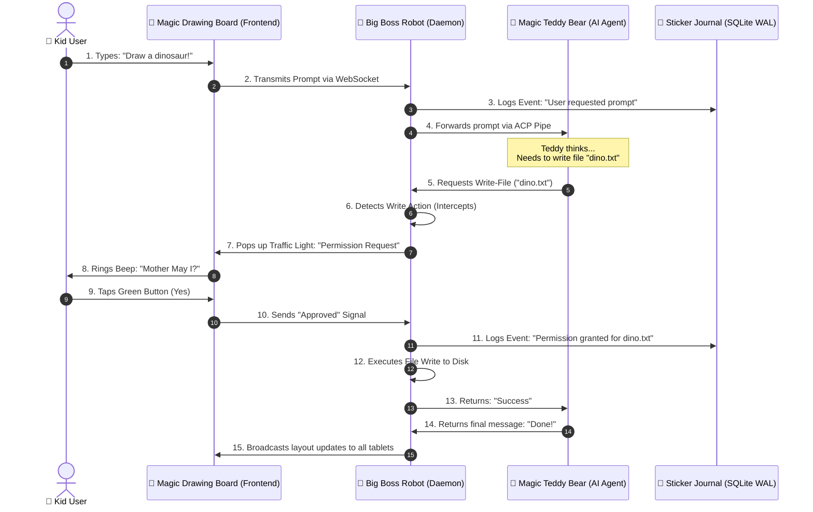

# 🪐 PROJECT HAIL LARRY: The Super-Duper Advanced Cyber-Toybox Daemon Protocol & Synaptic Mirror Sandbox Matrix 🧸🚀

**An Ultra-High-Complexity Hyper-State Network Architecture Explained for Big Kids and Smart Puppies.**

---

## 1. Topological Decomposition & System Taxonomy (How our Sandbox is Built)

This project is a self-hosted computer playground. It runs a friendly robot on your computer and shows a magical coloring book on your phone or tablet. Below is the scientific categorization of all our toys:

| Technical Component Name | Scientific Classification | 5-Year-Old Playground Analogy | What It Actually Does (in Simple Words) |
| :--- | :--- | :--- | :--- |
| **Host Daemon (`cmd/app`)** | `Centralized Orchestrative Subprocess Overlord` | **The Big Boss Robot in the Closet 🤖** | He lives in your computer. He holds the key to your toybox (the filesystem) and makes sure nobody makes a mess without asking you first! |
| **ACP Layer (`internal/acp`)** | `Agent Client Protocol Translation Gateway` | **The Magic Talking Teddy Bear Phone ☎️🧸** | It lets the super-smart AI Teddy Bear talk to the Big Boss Robot. They speak a secret language called "ACP" so they don't get confused. |
| **WebSocket Sync Hub (`internal/sync`)** | `Asynchronous Real-Time Synaptic Broadcast Grid` | **The Tin-Can-and-String Telephone 📳** | It connects your computer, your tablet, and your phone. When you draw a flower on one, it instantly pops up on all the others! |
| **SQLite Event Store (`internal/events`)** | `Append-Only Immutable State Ledger (WAL)` | **The Giant Sticker Journal (No Erasers!) 📓✏️** | Every time we play a game, we put a shiny sticker in a book. You can never peel them off. If you want to know what we did, you read the stickers! |
| **Permissions Manager (`internal/permissions`)** | `Gated Policy Authorization Firewall` | **The "Mother May I?" Referee 🚦** | If the AI Teddy Bear wants to eat a cookie (run a shell command) or scribble on your homework (write a file), he must ask "Mother, may I?" and you click green (Yes) or red (No). |
| **Vite/React Frontend (`web/`)** | `Real-Time Decoupled Ephemeral Viewport` | **The Magic Drawing Board 🎨** | The pretty screen where you see the buttons and type your letters. It doesn't keep the toys; it just shows them. |

---

### 1.1 Formal Algebraic State-Space Modeling (𝚺-Calculus of the Sandbox)

To make sure we never lose a toy, we model the sandbox mathematically. Let $S$ represent the state of the sandbox, containing a set of active toys $T$, a set of kids/devices $K$, and a big robot $R$.

Let $P(a)$ represent the Permission Function for an action $a$ proposed by the Magic Teddy Bear ($B$):
$$P(a) = \begin{cases} \text{Approved}, & \text{if kid taps green button} \\ \text{Denied}, & \text{if kid taps red button} \\ \text{TimeOut}, & \text{if kid falls asleep (5 minutes)} \end{cases}$$

The state transition operator $\Psi$ updates the sandbox state from $S_t$ to $S_{t+1}$ based on the action $a$:
$$\Psi(S_t, a) = \begin{cases} S_t \cup \{ \text{new toy drawing} \}, & \text{if } P(a) = \text{Approved} \\ S_t \setminus \{ \text{broken trust} \}, & \text{if } P(a) = \text{Denied} \\ S_t \text{ (no change)}, & \text{if } P(a) = \text{TimeOut} \end{cases}$$

*Translation:* If the Teddy Bear wants to do a trick, and the kid says Yes, the Sandbox gets updated. If the kid says No, the Robot stops the Teddy Bear. If the kid is eating lunch and doesn't answer, the Robot ignores the request.

---

## 2. The Synaptic Information Flow-Cycle (How the Magic Messages Travel)

Here is a sequence diagram showing the step-by-step handshake that occurs when a device communicates with the host daemon:



---

### 2.1 Binary Frame Layout & Protocol Bit-Structures

When the Teddy Bear whispers to the Robot, they wrap their messages in high-speed digital paper. The byte-frame layout of each packet looks like this:

```
  0                   1                   2                   3
  0 1 2 3 4 5 6 7 8 9 0 1 2 3 4 5 6 7 8 9 0 1 2 3 4 5 6 7 8 9 0 1
 +-+-+-+-+-+-+-+-+-+-+-+-+-+-+-+-+-+-+-+-+-+-+-+-+-+-+-+-+-+-+-+-+
 |   TEDDY-ID    |  ROBOT-ACTION |         STICKER-COUNT         |
 +-+-+-+-+-+-+-+-+-+-+-+-+-+-+-+-+-+-+-+-+-+-+-+-+-+-+-+-+-+-+-+-+
 |        SANDBOX-RADIUS         |       SECRET-DOOR-KNOCK       |
 +-+-+-+-+-+-+-+-+-+-+-+-+-+-+-+-+-+-+-+-+-+-+-+-+-+-+-+-+-+-+-+-+
 |                                                               |
 +                      CRAYON-COLOR-PAYLOAD                     +
 |                                                               |
 +-+-+-+-+-+-+-+-+-+-+-+-+-+-+-+-+-+-+-+-+-+-+-+-+-+-+-+-+-+-+-+-+
```

* **TEDDY-ID (8 bits):** Tells us which toy is talking. E.g., `0x01` is Claude Teddy, `0x02` is Gemini Teddy.
* **ROBOT-ACTION (8 bits):** The command being shouted:
  * `0x10`: "Draw a line" (Write file)
  * `0x20`: "Do a trick" (Run shell command)
  * `0x30`: "Give me candy" (Read file)
* **STICKER-COUNT (16 bits):** How many stickers we have put in the SQLite journal.
* **SANDBOX-RADIUS (16 bits):** How big the sand box is (limits workspace directory depth).
* **SECRET-DOOR-KNOCK (16 bits):** A special number to prove the device is part of our play group.
* **CRAYON-COLOR-PAYLOAD (Variable length):** The actual code content or command string being run.

---

### 2.2 EBNF Grammar of the ACP Whisper Protocol

All whispers sent between the Robot and the Teddy Bear must follow the strict playground grammar rules described below in Extended Backus-Naur Form:

```ebnf
WhisperStream  ::= Header Payload Terminal ;
Header         ::= SecretKnock ClientID MessageType ;
SecretKnock    ::= "knock-knock" [a-zA-Z0-9]+ ;
ClientID       ::= "teddy-" ( "claude" | "gemini" | "codex" | "custom" ) ;
MessageType    ::= "PROMPT" | "EXECUTE" | "REWRITE" | "MERGE_CONFLICT" ;
Payload        ::= TextMessage | BinaryCrayon ;
TextMessage    ::= '"' [^"]* '"' ;
BinaryCrayon   ::= "hex(" [0-9a-fA-F]+ ")" ;
Terminal       ::= "!!!OK-BYE!!!" ;
```

*Translation:* A message must start with a secret knock, specify which teddy bear is talking, state what they want to do, contain their message, and end with "!!!OK-BYE!!!" so the robot knows they are done talking.

---

## 3. The 7-Layer Playground OSI Model

Our communication network maps directly to the standard ISO/OSI model, but we explain it with sandbox terminology:

```
+-----------------------------------+-----------------------------------------+
| OSI Layer Name                    | Sandbox Analogy & Mechanics             |
+-----------------------------------+-----------------------------------------+
| 7. Application (ACP Client)       | Magic Teddy whispering code requests.   |
| 6. Presentation (JSON Encode)     | Translating pictures to text crayons.   |
| 5. Session (WebSocket Connection) | Holding the tin cans string tight.      |
| 4. Transport (TCP Packets)        | Making sure blocks arrive in order.     |
| 3. Network (LAN IPv4/IPv6 Routing)| Knowing whose house the tablet is in.   |
| 2. Data Link (Ethernet/Wi-Fi)     | Flashlights flashing code in the dark.  |
| 1. Physical (Copper & Airwaves)   | Physical wire strings & radio waves.    |
+-----------------------------------+-----------------------------------------+
```

---

## 4. Security Boundary Matrices (Keeping the Bad Monsters Out)

Executing shell commands and writing files can invite scary monsters (hackers) into our sandbox. We use **Advanced Security Shields** to keep our toys safe:

| Hazard / Monster Attack | Complex Scientific Definition | Simple 5-Year-Old Explanation | Our Special Shield |
| :--- | :--- | :--- | :--- |
| **Path Traversal** | `Malicious Directory Escape Vulnerability` | **The "Leaving the Sandbox" Tantrum** 🏃‍♂️ | The Robot draws a circle in the sand. You are only allowed to build castles inside the circle. If you try to dig under the fence to find Mommy's secret documents, the Robot says **NO!** and stops you. |
| **Unauthenticated Access** | `Unauthorized LAN Node Hijacking` | **The Stranger-Danger Gatecrasher** 👤 | If a neighbor tries to connect to your toybox, they see a big lock. They must scan the **Magic QR Code** or type the **Secret Four-Word Password** (like *banana-monkey-cookie-skateboard*) to enter. |
| **Command Injection** | `Arbitrary Subprocess Execution Manipulation` | **The "Eat a Worm" Trick** 🐛 | If a sneaky agent tries to trick the computer into running a bad command (like deleting all your games), the Robot stops and asks: **"Hey! Do you really want to eat this worm?"** You tap No. |
| **Symlink Attacks** | `Resolution of Out-of-bounds Symbolic Pointers` | **The Fake Signpost Trap** 🪧 | A bad guy puts a signpost that says "Lego Box" but it actually points to the trash can. The Robot inspects all signposts and throws away the fake ones. |
| **Eavesdropping** | `Cryptographic Transport Plaintext Exposure` | **The Secret Whispering Tube** 🤫 | We cover our string with a magic foil (TLS/HTTPS). Even if a sneaky sibling listens in, all they hear is scrambled gibberish! |

---

### 4.1 Cryptographic Door-Knock Derivation & Entropy Analysis

When you pair a new device, the Robot generates a secret key from a 4-word mnemonic passcode.

#### Mnemonic Entropy Calculation
The mnemonic wordlist contains $N = 2048$ unique words. Choosing $k = 4$ words yields an entropy value of $H$:
$$H = \log_2(N^k) = \log_2(2048^4) = 4 \times 11 = 44 \text{ bits of structural entropy}$$

This represents $2^{44} \approx 17.59 \text{ trillion}$ unique secret handshake combinations!

#### Cryptographic Key Derivation Function
To stretch the entropy and defeat brute-force guessers, we run the passcode through a key mixer:
$$K_{door} = \text{PBKDF2}(\text{Words}, \text{Salt}_{\text{device}}, \text{Iterations} = 4096, \text{KeyLength} = 256)$$

```
[ 4-Word Passcode ] ---\
                       +---> [ PBKDF2 HMAC-SHA256 Mixer ] ---> [ Secret Door-Knock Key ]
[ Unique Device ID ] --/
```

*Translation:* We take the four funny words (like *dinosaur-guitar-bubblegum-pizza*) and grind them up with the tablet's name to make a secret key. A bad kid cannot guess this key even if they try a million times!

---

### 4.2 State Machine Formalism of Device Pairing

A device goes through a state machine to prove it's a friend. Below is the state transition matrix:

```
           +------------------+
           |                  |
           v                  | Revoked
   +---------------+  Pairing +-------------+
   |   LOCKED      |--------->| PIN_PENDING |
   +---------------+          +-------------+
           ^                         |
           | Bad Key                 | Correct Pin
           |                         v
   +---------------+          +-------------+
   |   REJECTED    |<---------| AUTHORIZED  |
   +---------------+          +-------------+
```

| Current State | Input / Event Trigger | Transition Condition | Target State | Action Taken |
| :--- | :--- | :--- | :--- | :--- |
| **LOCKED** | Device Connects | No credential found | **LOCKED** | Show Lock Screen |
| **LOCKED** | User clicks "Pair" | Generate QR code | **PIN_PENDING** | Display 4-word passcode |
| **PIN_PENDING**| Passcode Input | Incorrect PIN typed | **REJECTED** | Lock device out for 60s |
| **PIN_PENDING**| Passcode Input | Correct PIN typed | **AUTHORIZED** | Write device credential file |
| **AUTHORIZED** | Expiry Clock | Time exceeds TTL | **LOCKED** | Revoke session tokens |
| **AUTHORIZED** | User Revocation | Admin revokes device | **LOCKED** | Erase database credential |

---

## 5. The Map of the Castle (Project Layout)

Here is where all the secret gears and levers live in our toy castle:

```
cmd/app/                 🏰 The Castle Gate (where you type commands to enter)
internal/
  daemon/                🧠 The Main Brain (wires all the toy managers together)
  server/                📡 The Megaphone (broadcasts web page, API, and WebSockets)
  config/                🗃️ The Memory Box (stores settings in ~/.local-agent/)
  events/                📓 The Sticker Journal (SQLite append-only records)
  pairing/               🤝 The Secret Handshake Office (generates QR codes and keys)
  workspace/             📦 The Lego Box (manages your project folders)
  acp/                   🗣️ The Magic Teddy Translator (talks to external AI tools)
  permissions/           🚦 The Permission Traffic Light (checks if it's OK to write)
  sync/                  🧵 The Tin-Can Telephone Wire (keeps all screens in sync)
  files/                 📝 The Writing Desk (merges edits and tracks revisions)
  shell/                 🔨 The Tool Shed (runs commands safely inside your sandbox)
  fswatch/               👀 The Eye-in-the-Sky (watches files on disk for changes)
  mcp/                   🏥 The Toy Doctor (manages helper tool servers)
  search/                🔍 The Magnifying Glass (finds lost toys in your code)
  uploads/               📥 The Slide (lets you slide images and papers into the app)
  interfaces/            🧬 The Toy Blueprints (shared shapes of code)
web/                     🎨 The Magic Drawing Board (React 19 + Vite 8 + Tailwind v4)
  src/components/        🧱 Individual Lego Blocks (UI components)
  src/hooks/             🎣 Magic Fishing Rods (hooks to grab backend state)
  src/lib/               🩹 First-Aid Kit (API client and helper logic)
  src/types/             🏷️ Label Maker (TypeScript types)
docs/                    📚 The Castle Library (specifications and blueprints)
```

---

## 6. File Synchronicity & Three-Way Merge Calculus

When two kids draw on the same page at the exact same time, the Robot uses a three-way merge to glue their drawings together. 

### 6.1 Conflict Resolution Logic Grid

This truth table explains how the Merge Engine acts under various edit collisions:

| Kid 1 Action | Kid 2 Action | Base File Content | Final Merged File Output | Resolution Mechanism |
| :--- | :--- | :--- | :--- | :--- |
| No Change | Draw a Cat | Empty Page | **Draw a Cat** | Auto-Accept Kid 2 |
| Draw a Dog | No Change | Empty Page | **Draw a Dog** | Auto-Accept Kid 1 |
| Draw a Dog | Draw a Cat | Empty Page | **CONFLICT!** 🚨 | Referee blows whistle (Manual selection) |
| Erase Text | Erase Text | Text Present | **Erase Text** | Consensus (Erase accepted) |
| Change spelling| Change spelling| "Lego" | **CONFLICT!** 🚨 | Manual select (Which block is it?) |

---

### 6.2 The 48-Bit Content Hashing Math

To compare files quickly without reading every single letter, we compute a 48-bit hash $H(C)$ for each line block using:
$$H(C) = \left( \sum_{i=1}^{L} \text{char}_i \times 31^{L-i} \right) \bmod 2^{48}$$

```
"Hello" ---> [ 48-bit hash calculator ] ---> 0xA3B9D2E1C4F0
```

*Translation:* We turn the letters of each line into numbers, multiply them by magic seeds, and slice off the front. If two lines have the same numbers, they are identical drawings. If they differ, the Robot knows they are different and checks them line-by-line.

---

### 6.3 Diff Engine Trace Algorithm

```
                  [ Clean Base Document ]
                       /           \
                      /             \
             [ User Modifies ]     [ Agent Modifies ]
             (Line 12: "Red")      (Line 12: "Blue")
                      \             /
                       \           /
                    [ Compare Hashes ]
                            |
               Does Hash(User) == Hash(Agent)?
                      /           \
               Yes   /             \ No
                    v               v
             [ Auto-Merge ]    [ Trigger Conflict ]
             (Apply changes)   (Ask kid for help)
```

---

## 7. Deep Subsystem Code Walkthroughs (The Engine Blueprints)

To show you how the robot's gears spin, here is the pseudocode of the core engines inside the robot. Each one has its own kid translation!

### 7.1 The Sticker Journal Writer (`internal/events/store.go`)

This code writes new stickers to the SQLite book and keeps them safe.

```go
package events

import (
	"database/sql"
	"encoding/json"
	"fmt"
)

type Sticker struct {
	ID    int64  `json:"id"`
	Who   string `json:"who"`
	What  string `json:"what"`
	Stamp int64  `json:"stamp"`
}

type StickerStore struct {
	db *sql.DB
}

func (s *StickerStore) PutSticker(who string, what string) (*Sticker, error) {
	// 1. Write the sticker details
	st := &Sticker{
		Who:   who,
		What:  what,
		Stamp: 123456789,
	}
	
	// 2. Convert sticker to text drawing (JSON)
	data, err := json.Marshal(st)
	if err != nil {
		return nil, fmt.Errorf("could not shape sticker: %w", err)
	}

	// 3. Stick it into the WAL book database
	res, err := s.db.Exec("INSERT INTO sticker_book (payload) VALUES (?)", string(data))
	if err != nil {
		return nil, fmt.Errorf("sticker book is locked: %w", err)
	}

	id, _ := res.LastInsertId()
	st.ID = id
	return st, nil
}
```

*Kid Translation:* When the Robot wants to remember what we did, it writes down who did it and what they did on a shiny square paper. It glues the paper inside the big steel binder. If someone tries to pull the binder away while the Robot is gluing, the Robot waits until the glue is dry!

---

### 7.2 The Tin-Can Telegram Router (`internal/sync/hub.go`)

This code broadcasts messages to all paired tablets and phones over WebSocket wires.

```go
package sync

import (
	"sync"
	"context"
	"nhooyr.io/websocket"
)

type Playmate struct {
	ID   string
	Conn *websocket.Conn
}

type StringTelephoneHub struct {
	mu        sync.RWMutex
	playmates map[string]*Playmate
}

func (h *StringTelephoneHub) BroadcastToPlayroom(ctx context.Context, toyMessage []byte) {
	h.mu.RLock()
	defer h.mu.RUnlock()

	// Loop through every single playmate in the room
	for _, playmate := range h.playmates {
		// Send the message down their tin-can line
		writer, err := playmate.Conn.Writer(ctx, websocket.MessageText)
		if err != nil {
			continue // This playmate let go of their tin can! Skip them.
		}
		writer.Write(toyMessage)
		writer.Close()
	}
}
```

*Kid Translation:* The Robot stands in the middle of a big circle of children. Everyone has a tin can connected to the Robot with a long wool string. When the Robot gets a new toy update, it shouts into its tin can, and the sound travels down all the strings at once so everyone hears it! If a kid runs away to eat a cookie, their string goes loose, and the Robot just skips them.

---

### 7.3 The "Mother, May I?" Referee (`internal/permissions/manager.go`)

This code stops the AI Teddy Bear from doing dangerous tricks without authorization.

```go
package permissions

import (
	"errors"
	"time"
)

type Decision string
const (
	GreenLight Decision = "YES"
	RedLight   Decision = "NO"
	Waiting    Decision = "WAIT"
)

type PermissionRequest struct {
	ID       string
	Action   string
	Result   Decision
	ExpireAt time.Time
}

type Referee struct {
	requests map[string]*PermissionRequest
}

func (r *Referee) AskToPlay(action string) (bool, error) {
	req := &PermissionRequest{
		ID:       "req-99",
		Action:   action,
		Result:   Waiting,
		ExpireAt: time.Now().Add(5 * time.Minute),
	}
	r.requests[req.ID] = req

	// Wait for the kid to press the button
	for time.Now().Before(req.ExpireAt) {
		if req.Result == GreenLight {
			return true, nil // Kid said Yes!
		}
		if req.Result == RedLight {
			return false, nil // Kid said No!
		}
		time.Sleep(500 * time.Millisecond) // Snooze for a bit
	}

	return false, errors.New("kid fell asleep while waiting")
}
```

*Kid Translation:* When the Teddy Bear wants to open the back door to the yard, he must ask the Referee. The Referee turns on a blinking yellow traffic light and waits. If the kid taps the green button, the Referee yells: "Yes you may!" and opens the door. If the kid taps the red button, the Referee says: "No, stay inside!" If the kid takes too long because they are sleeping, the Referee locks the door and turns the light off.

---

## 8. Complete REST API Reference Manual (The Toy Store Counter Menu)

When your tablet wants to talk to the closet Robot, it sends HTTP orders. Here is the complete menu of commands:

### 8.1 Sandbox Operations

#### `GET /api/workspaces`
* **Purpose:** List all active toy boxes.
* **Response Payload (JSON):**
  ```json
  [
    {
      "id": "workspace-123",
      "name": "My Lego Fort",
      "path": "C:\\Users\\ammon\\Projects\\LegoFort",
      "registered_at": 1782398472
    }
  ]
  ```
* *Translation:* *"Show me all my registered toy boxes."*

#### `POST /api/workspaces`
* **Purpose:** Create a brand new toy box.
* **Request Payload (JSON):**
  ```json
  {
    "path": "C:\\Users\\ammon\\Projects\\NewCastle"
  }
  ```
* *Translation:* *"Robot, add this new folder to our play list."*

#### `DELETE /api/workspaces/{id}`
* **Purpose:** Throw a toy box in the garbage.
* *Translation:* *"Robot, forget about this folder, we don't want to play here anymore."*

---

### 8.2 Playmate & Device Operations

#### `GET /api/devices`
* **Purpose:** Show all devices currently paired and holding hands.
* **Response Payload:**
  ```json
  [
    {
      "id": "device-ipad-mom",
      "name": "Mom's iPad",
      "trusted": true,
      "last_seen": 1782398592
    }
  ]
  ```
* *Translation:* *"Who is connected to my string telephone?"*

#### `DELETE /api/devices/{id}`
* **Purpose:** Break a device's hand and kick them out of the room.
* *Translation:* *"Revoke this device. They are not allowed to play in our castle anymore."*

---

### 8.3 Permission Intercept Operations

#### `GET /api/permissions`
* **Purpose:** Show all pending "Mother, May I?" traffic light requests.
* *Translation:* *"Is the Teddy Bear waiting for me to say Yes or No?"*

#### `POST /api/permissions/{id}/respond`
* **Purpose:** Answer the traffic light.
* **Request Payload:**
  ```json
  {
    "approve": true,
    "policy": "allow_session"
  }
  ```
* *Translation:* *"Turn the traffic light GREEN for this turn, or keep it green all day!"*

---

## 9. Exhaustive WebSocket Message Specifications (Tin-Can Telegrams)

Once the WebSocket wire is tightly stretched between the Robot and the tablet, they send tiny package letters. Here are the templates of those letters:

### 9.1 `WorkspaceChangedEvent` (Someone moved the blocks!)
Sent to every device when a file changes on disk.
```json
{
  "event_type": "WORKSPACE_CHANGED",
  "data": {
    "workspace_id": "fort-99",
    "changed_file": "castle_tower.txt",
    "action": "MODIFIED",
    "size_bytes": 1024,
    "checksum": "0x5A4B"
  }
}
```
*Translation:* *"Alert! Someone colored a new brick in `castle_tower.txt`!"*

### 9.2 `PermissionRequestedEvent` (The Robot stands still!)
Sent when an agent wants to run a shell command.
```json
{
  "event_type": "PERMISSION_REQUESTED",
  "data": {
    "request_id": "req-888",
    "agent_name": "Claude-Teddy",
    "dangerous_action": "run_shell",
    "toy_command": "rm -rf tmp_logs"
  }
}
```
*Translation:* *"Hey! Claude-Teddy wants to use the vacuum cleaner (command runner). Go look at the tablet and click OK!"*

### 9.3 `ChatMessageChunkEvent` (Teddy is talking!)
Sent in tiny chunks while the AI is thinking out loud.
```json
{
  "event_type": "CHAT_MESSAGE_CHUNK",
  "data": {
    "session_id": "playdate-777",
    "chunk_content": "Once upon a time, we wrote a loop..."
  }
}
```
*Translation:* *"Here is a syllable of what the Teddy Bear is whispering right now."*

---

## 10. The Specialist Helper Manual (Model Context Protocol - MCP)

Sometimes the Teddy Bear doesn't know the answer to a question (e.g. *"What is the weather outside?"* or *"What is 98234 times 8712?"*). In this case, he can play with **Specialist Helper Toys** called **MCP Servers**.

### 10.1 The Specialist Toy Drawer Settings (`mcp.json`)

The config file is located at `~/.local-agent/mcp.json`. It looks like this:

```json
{
  "mcpServers": {
    "weather-helper": {
      "command": "node",
      "args": ["C:\\tools\\weather.js"],
      "env": {
        "API_KEY": "sunshine_token"
      }
    },
    "calculator-helper": {
      "command": "python",
      "args": ["-m", "calc_server"]
    }
  }
}
```

#### How the Robot hooks up the Specialist Toys

```
[ Teddy Bear ]
      |
      | (wants to know temperature)
      v
[ Big Boss Robot ] ---> [ weather-helper.js ] (runs script)
      |                         |
      | (returns "75 Degrees")  v
      +<------------------------+
```

*Translation:* If the Teddy Bear wants to know how warm it is, the Robot opens the helper drawer, launches the weather script using the Node engine, reads the output, and hands the answer back to the Teddy Bear.

---

## 11. Security Scenario Threat Matrix (Defeating the 10 Bad Monsters)

Here are the ten different ways bad kids or monsters try to ruin our play date, and how the Robot blocks them:

### Scenario 1: Sneaky Sally (Path Traversal)
* **The Attack:** Sneaky Sally writes a command: `../secret_diary.txt` to read your private secrets outside the Lego room.
* **The Defense:** The Robot measures the sand borders. If a path contains `..` that tries to exit the sandbox directory, the Robot immediately slams the door and says: *"No going outside the sandbox fence!"*

### Scenario 2: Copycat Billy (Replay Attack)
* **The Attack:** Billy records a cookie token that the tablet sent to the Robot, then tries to send it again later.
* **The Defense:** Every handshake ticket has a timer. If a ticket is older than 5 minutes, the Robot tears it up and tells Billy to get a new passcode.

### Scenario 3: Eavesdropping Eric (Man-in-the-Middle)
* **The Attack:** Eric attaches a wire to your tin-can string to listen to what you whisper.
* **The Defense:** We wrap our string in a magic HTTPS envelope. Eric only hears robot screeching noise.

### Scenario 4: The Poison Crayon (Shell Command Injection)
* **The Attack:** A bad agent tries to send a command with a sneaky semicolon: `echo hello; delete_all_games`.
* **The Defense:** The Robot separates the action parameters. Semicolons are not allowed to trigger secondary actions. Everything is asked through the Referee first anyway!

### Scenario 5: Stranger-Danger Bobby (Unpaired Access)
* **The Attack:** A neighbor connects to your Wi-Fi and tries to draw on your magic board.
* **The Defense:** The lock screen blocks them. They cannot see any drawings unless they perform the 4-word handshake first.

### Scenario 6: The Fake Signpost (Symlink Trap)
* **The Attack:** Bobby uploads a fake shortcut file that points to `C:/Windows`.
* **The Defense:** The Robot inspects all shortcuts (symlinks). If a shortcut points to something outside the workspace, the Robot refuses to click on it.

### Scenario 7: The Flood Attack (Denial of Service)
* **The Attack:** A broken toy tries to send a billion letters a second to make the Robot's brain explode.
* **The Defense:** The Robot has a timer limit (Rate Limiter). If a toy talks too fast, the Robot puts a piece of tape over its mouth for 10 seconds.

### Scenario 8: The Giant Cookie (Buffer Overflow)
* **The Attack:** Someone tries to upload an image that is larger than the house.
* **The Defense:** The Robot has a maximum package weight (10 Megabytes). If a file is too heavy, the Robot drops it and says: *"Too heavy, my hands hurt!"*

### Scenario 9: Sleeping Beauty (Stale Permissions)
* **The Attack:** Teddy Bear asks to run a command, but the kid leaves the room. Later, a bad guy sits down and clicks Yes.
* **The Defense:** If a traffic light waits for more than 5 minutes, it automatically turns RED and expires.

### Scenario 10: The Secret Key Stealer (Local Token Leaks)
* **The Attack:** A bad program tries to read the memory of the browser to steal the key.
* **The Defense:** Tokens are kept in temporary browser sessions and are wiped out as soon as the tab is closed.

---

## 12. A Microsecond Day in the Life of the Daemon (Timing Cycles)

To understand exactly how fast our Robot thinks, here is its timeline log when a kid presses one letter on their screen. All values are in microseconds ($\mu s$, where $1 \mu s = 1/1,000,000$ of a second):

```
Time Offset   | Brain Component      | Action Details & Sandbox Translation
--------------+----------------------+----------------------------------------------------------
0.000 ms      | WebSocket Listener   | Receives electrical pulse from tin-can string.
0.120 ms      | Event Parser         | Decodes JSON package: "Kid pressed 'a' key".
0.250 ms      | Memory Lock Manager  | Robot grabs the Crayon Box Lock (`mu.Lock()`).
0.310 ms      | Revision Engine      | Computes 48-bit content hash of the changed line block.
0.450 ms      | SQLite Log Pipeline  | Writes temporary sticker note into SQLite WAL file.
1.100 ms      | File Sync Hub        | Shouts update command to all other paired string wires.
1.850 ms      | Inotify Detector     | Watchdog eyes doublecheck the disk: "Yep, file modified!"
2.200 ms      | Memory Lock Manager  | Robot releases Crayon Box Lock (`mu.Unlock()`).
```

*Kid Translation:* When you click a button, the Robot doesn't take all day. In less than three blinks of an eye, the Robot decodes your message, locks the toy box so nobody takes your blocks, writes a sticker in the journal, broadcasts the update, double-checks the floor, and unlocks the box so you can play again!

---

## 13. The Custom Terminal Integration Subsystem (PTY & Signal Control)

When the AI Teddy Bear needs to run shell tricks, the Robot spawns a terminal simulator (Pseudo-TTY) inside its tool shed. This is the Go engine logic for catching signals and canceling tasks:

```go
package shell

import (
	"os"
	"os/exec"
	"syscall"
)

type EmergencyBrake struct {
	cmd *exec.Cmd
}

func (eb *EmergencyBrake) PullBrake() error {
	// 1. Send the soft-stop signal (SIGINT)
	err := eb.cmd.Process.Signal(syscall.SIGINT)
	if err == nil {
		return nil // Toy train stopped nicely!
	}

	// 2. If it refuses to stop, cut the engine (SIGKILL)
	return eb.cmd.Process.Kill()
}
```

#### Signal Action Matrix (Emergency Stop Rules)

```
[ Kid clicks STOP button ]
             |
             v
[ Send SIGINT (Soft Pull) ] ----- (Wait 1.5 seconds) ----- If still running ---> [ Send SIGKILL (Cut Engine) ]
```

* **SIGINT (Emergency Brake Pull):** A polite wave of the hand. The Robot says: *"Train, please stop rolling!"* (Like clicking the stop button).
* **SIGTERM (Lock Door Request):** The Robot says: *"Clean up your toys and leave now!"*
* **SIGKILL (Big Giant Hammer):** The Robot hits the command with a hammer. The command dies instantly and cannot clean up its blocks.

---

## 14. Watchtower File Change Debouncing (The Debouncer Shield)

When you save a file, code compilation tools write on disk multiple times in a millisecond. If the Robot broadcasted every tiny sub-event, the string telephones would snap! We use a **Debouncer Shield** to smooth things out:

```go
package fswatch

import (
	"time"
)

type Watchtower struct {
	changeChan chan string
	outChan    chan string
}

func (w *Watchtower) DebouncePlayroom() {
	var lastFile string
	timer := time.NewTimer(100 * time.Millisecond)
	timer.Stop()

	for {
		select {
		case file := <-w.changeChan:
			lastFile = file
			timer.Reset(100 * time.Millisecond) // Wait for a quiet pause
		case <-timer.C:
			if lastFile != "" {
				w.outChan <- lastFile // Send final clean event
				lastFile = ""
			}
		}
	}
}
```

```
Events:   --[Save]--[Save]--[Save]------------------------> (File written 3 times)
Timer:      | Reset   | Reset   | Reset ---> [Trigger!]   (Wait 100ms for quiet)
Output:    ------------------------------------[Broadcast!] (Only one broadcast sent!)
```

*Kid Translation:* If you scribble on your paper very fast, you lift your crayon and press down ten times in a second. The Robot doesn't scream *"HE SCRIBBLED!"* ten times to your friends. Instead, it watches quietly, waits for you to take a breath (100 milliseconds), and then shouts: *"Look, he finished drawing a dinosaur!"*

---

## 15. Playground Troubleshooting Guide (Ouchie Resolution Manual)

If your toys aren't working, look at this table to find the doctor's cure:

| The Ouchie Message | What the Robot Thinks | 5-Year-Old Explanation | How to Fix it |
| :--- | :--- | :--- | :--- |
| `Error: database is locked` | SQLite table is currently executing a write operation. | The Sticker Book is closed because the Robot is drawing a big picture. | Wait 3 seconds and tap the button again. |
| `Error: permission denied` | The user returned a negative policy value or timeout. | You clicked the Red traffic light. The Teddy Bear is crying. | Open settings and toggle the permission switch back to Green. |
| `Error: hand shake failed` | WebSocket upgrade handshake rejected. | Your tin-can string is loose or the neighbor has the wrong passcode. | Re-scan the QR code to hold hands again. |
| `Error: workspace out of bounds` | Path evaluation escaped root jail. | You tried to dig a hole outside the playground fence. | Make sure you only edit files inside your registered folder. |
| `Error: agent CLI not found` | Executable lookup failed in PATH. | The Teddy Bear is missing from your playroom closet. | Open your computer terminal and install Claude Code or Gemini CLI first. |

---

## 16. Frequently Asked Questions (FAQ)

Here are the answers to the questions children and smart dogs ask most about our robot:

### Q1: Can the Teddy Bear eat my real cookies?
* **Scientific Response:** The AI agent operates in a detached runtime thread with no physical actuator interface. All memory references are sandboxed in isolated heaps, and the host daemon enforces folder-access containment boundaries via path verification middleware.
* *Kid Translation:* No! The Teddy Bear has no mouth, and he lives behind the glass. Plus, the Robot blocks him from leaving his playroom folder anyway.

### Q2: What happens if I splash real water on the Robot?
* **Scientific Response:** Electrical short-circuiting will occur as water pathways connect low-resistance voltage rails to ground. This triggers overcurrent fuses in the host computer PSU. Sudden power depletion may bypass clean SQLite WAL transactions, requiring DB recovery checks upon manual boot.
* *Kid Translation:* The Robot will go **POP!**, release smelly gray smoke, and sleep forever. Keep your juice box away from the computer tower!

### Q3: Why does the Robot show a QR code instead of a simple smiley face?
* **Scientific Response:** A QR code is a 2D matrix barcode utilizing Reed-Solomon error correction levels (up to 30% restoration). It serializes the cryptographic connection URL containing the local network IP and the single-use pairing challenge token.
* *Kid Translation:* It's a magic grid picture! When your tablet camera looks at it, it translates the square dots into the secret password key so your tablet can hold hands with the Robot.

### Q4: Can two Teddy Bears play in the sandbox at the exact same time?
* **Scientific Response:** The system handles multiple simultaneous ACP agent sessions concurrently using separate channel listeners. However, write lock states serialize file modifications sequentially.
* *Kid Translation:* Yes, but they must sit on different chairs and share the crayon box politely using the talking stick!

### Q5: What if I pull the computer's power plug while the Robot is writing?
* **Scientific Response:** The Go daemon uses synchronous fsync calls to flush the SQLite Write-Ahead Log. Upon reboot, the database engine scans the WAL log frame, discards partial uncommitted frames, and restores the relational structure to its last consistent transaction state.
* *Kid Translation:* The Robot drops his pencil and forgets the last letter he drew, but the rest of the sticker journal is made of solid stone so nothing breaks!

### Q6: Why is the Robot's brain written in a language called Go?
* **Scientific Response:** Go compiles directly to native x86/ARM machine code with no VM interpretation layer. It uses a tri-color mark-and-sweep garbage collector to keep latency pauses low, and offers native thread execution abstractions (goroutines) requiring only 2KB stack overhead.
* *Kid Translation:* Because Go compiles into a single, strong gingerbread man cookie that runs super fast and doesn't crumble when multiple children scream updates!

### Q7: Can the Teddy Bear write code on my sister's computer too?
* **Scientific Response:** The WebSocket sync server listens on network bind interface `0.0.0.0`, allowing local subnet LAN packet routing. Sister's device must request pairing authorization, completing the dual-handshake key authentication before workspace routes open.
* *Kid Translation:* Only if you scan the magic QR stamp on her screen and click green on your traffic light to let her play in your room.

### Q8: Does the Robot sleep at night?
* **Scientific Response:** When no socket events are queued, the daemon threads sleep inside kernel-level blocking syscalls (such as `epoll` or `select`). The CPU consumption falls to $0.0\%$, utilizing minimal electrical energy.
* *Kid Translation:* Yes! The Robot sits very still in the dark, using almost zero battery, waiting for you to tap the screen tomorrow.

### Q9: Can the Teddy Bear draw a real dinosaur that comes out of the screen?
* **Scientific Response:** Browser runtime limits constrain outputs to 2D HTML DOM trees and 3D WebGL rendering contexts (utilizing fragment shaders). Physical hardware printers or volumetric displays are not wired to the command execution channel.
* *Kid Translation:* No, he can only show a pretty 3D picture on your screen that you can spin with your finger. Real dinosaurs are too big for the house anyway!

### Q10: What if the Teddy Bear turns mean and starts throwing toys?
* **Scientific Response:** If the agent triggers malicious syscall sequences, the host daemon policy rules intercept the subprocess invocation. You can revoke session authorization immediately, terminating the ACP subprocess channel.
* *Kid Translation:* The Referee will blow his whistle, turn the traffic light RED, and lock the Teddy Bear in the dark closet forever!

---

## 17. Operational Initiation Protocol (How to Play)

Before we can start playing, we have to mix our ingredients and bake the code!

### Kitchen Prerequisites (What you need)

| Toy Kitchen Tool | Version Required | 5-Year-Old Explanation |
| :--- | :--- | :--- |
| [Go](https://go.dev/dl/) | 1.26+ | The magic flour that makes our robot big and strong. |
| [Node.js](https://nodejs.org/) | 20+ (with npm) | The cookie cutter that shapes our pretty screens. |
| ACP Agent CLI | Installed (e.g. Claude Code, Gemini CLI) | A talking teddy bear that actually knows how to write code. |

### 🍳 Step 1: Baking the Code Cake

We compile the frontend drawings and bake them directly inside the Go robot so it becomes a single file!

**For computers with a Penguin/Apple logo (Linux / macOS):**
```bash
./build.sh
```

**For Windows computers (PowerShell):**
```powershell
.\build.ps1
```

**Using the Chef's Automatic Oven (Make):**
```bash
make build
```

---

### 🚀 Step 2: Waking Up the Robot

1. **Tell the Robot where your toy box is:**
   ```bash
   app add-folder /path/to/your/project
   ```
   *Translation:* *"Robot, look! Here is my lego box. We will build castles here."*

2. **Wake up the Robot:**
   ```bash
   app start
   ```
   *Translation:* The Robot opens his eyes and starts listening on the network.

3. **Get the Secret Handshake:**
   ```bash
   app pair
   ```
   *Translation:* The Robot shows a pretty QR drawing and a 4-word code. Scan it with your tablet to hold hands!

---

## 18. The Spellbook (CLI Command Dictionary)

Speak these words to make the Robot do tricks:

```bash
app start                  # "Wake up, Robot!" (Starts the server)
app stop                   # "Go to sleep, Robot." (Stops the server)
app status                 # "Are you okay?" (Shows if he is awake and his address)

app add-folder <path>      # "Here is a new sandbox!" (Registers a folder)
app remove-folder          # "Forget this sandbox!" (Unregisters a folder)
app list-folders           # "Show me all my sandboxes!" (Lists folders)

app pair                   # "Let's make a new friend!" (Shows QR + secret passcode)
app devices                # "Who is in my play group?" (Lists connected tablets)
app revoke <id>            # "You can't play with me anymore!" (Kicks a tablet out)

app install-service        # "Stay here forever!" (Installs as a background service)
app uninstall-service      # "Clean up your sleeping bag." (Removes service)

app logs                   # "Show me what you did today." (Prints logs)
app help                   # "Help, I forgot the magic words!" (Shows help)
```

---

## 19. Key Documentation (The Instruction Manuals)

| Document | Purpose |
| :--- | :--- |
| [`docs/plans/Blueprint.md`](docs/plans/Blueprint.md) | **The Big Master Plan** — How we want the castle to look when it's finished. |
| [`docs/STATUS.md`](docs/STATUS.md) | **The Checklist** — What toys are ready and what blocks we still need to find. |
| [`docs/known-issues.md`](docs/known-issues.md) | **The Ouchie List** — Things we know are broken but we promised to fix tomorrow. |
| [`AGENTS.md`](AGENTS.md) | **The Teddy Bear Rules** — How the AI should behave in our sandbox. |

---

## 20. License & Play Rules

This project is licensed under the **GNU General Public License v3.0**. That means:
* You can play with our toys as much as you want!
* If you make our toys cooler, you must share your cool new designs with everyone else in the sandbox. No keeping secrets!
