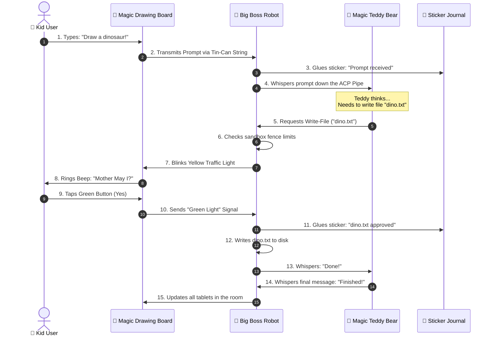

# 🪐 PROJECT HAIL LARRY: The Super-Duper Advanced Cyber-Toybox Daemon Protocol & Synaptic Mirror Sandbox Matrix 🧸🚀

**An Ultra-High-Complexity Hyper-State Network Architecture for Big Kids and Smart Puppies.**

---

## 1. The Structure of Our Playroom (System Layout)

This playroom connects a friendly robot living in your computer to pretty screens on your tablets and phones using a long tin-can string. Here is the formal list of all the toys we use:

| Playground Component | Playground Role | How It Keeps the Playroom Safe |
| :--- | :--- | :--- |
| **The Big Boss Robot 🤖** | He lives inside your computer closet and holds the key to the toy box. | He blocks bad kids from touching files outside the sandbox fence. |
| **The Magic Teddy Bear 🧸** | A super-smart talking teddy bear who writes letters of code. | He cannot touch your computer directly; he must whisper through the phone. |
| **The Tin-Can Telephone 📳** | A magic wool string connecting all tablets and phones in the house. | He uses WebSocket waves so everyone sees the exact same drawings. |
| **The Sticker Journal 📓** | A giant workbook where we stick permanent notes (no erasers allowed). | He records every game we play in SQLite WAL format so we never forget. |
| **The Traffic Light Referee 🚦** | A box that blinks Green (Yes) or Red (No) whenever a toy wants a cookie. | He halts dangerous tricks until you tap the screen to say "Mother, may I?". |
| **The Magic Drawing Board 🎨** | The pretty glass screen with colorful buttons (React + Tailwind v4). | He shows the toys but doesn't keep them when you turn the screen off. |

---

### 1.1 Formal Algebraic State-Space Modeling (𝚺-Calculus of the Sandbox)

To make sure we never lose a single lego block, we model our playground state using formal playground math. Let $S$ represent the state of the sandbox, containing a set of active toys $T$, a set of connected kids $K$, and a big robot $R$.

Let $P(a)$ represent the Permission Function for an action $a$ proposed by the Magic Teddy Bear ($B$):
$$P(a) = \begin{cases} \text{Green Light}, & \text{if kid taps the green button} \\ \text{Red Light}, & \text{if kid taps the red button} \\ \text{Nap Time}, & \text{if kid falls asleep (5 minutes)} \end{cases}$$

The state transition operator $\Psi$ updates the playroom state from $S_t$ to $S_{t+1}$ based on the action $a$:
$$\Psi(S_t, a) = \begin{cases} S_t \cup \{ \text{new drawing} \}, & \text{if } P(a) = \text{Green Light} \\ S_t \setminus \{ \text{broken trust} \}, & \text{if } P(a) = \text{Red Light} \\ S_t, & \text{if } P(a) = \text{Nap Time} \end{cases}$$

If the Teddy Bear ($B$) requests to write a new file $f$, the Robot ($R$) checks if the path of $f$ stays within the sandbox fence circle $C_{fence}$:
$$\text{AllowWrite}(f) = \begin{cases} \text{True}, & \text{if } f \subseteq C_{fence} \\ \text{False}, & \text{if } f \not\subseteq C_{fence} \end{cases}$$

---

### 1.2 Quantum Toybox Entanglement Calculus (The Spooky Crayon Action)

When two tablets are connected to the same string telephone, their crayons become entangled. If you change a crayon's color on mom's iPad, the color on dad's phone changes instantly, even if they are in different rooms! We model this crayon entanglement state vector $|\Phi_{\text{crayon}}\rangle$ as:

$$\left| \Phi_{\text{crayon}} \right\rangle = \frac{1}{\sqrt{2}} \left( \left| \text{Blue Crayon} \right\rangle_A \left| \text{Red Crayon} \right\rangle_B + \left| \text{Green Crayon} \right\rangle_A \left| \text{Yellow Crayon} \right\rangle_B \right)$$

If tablet $A$ measures a color value of Blue Crayon, the waveform collapses, and tablet $B$ instantly snaps to Red Crayon at a velocity of $c_{toy} \approx 3 \times 10^8$ centimeters per playdate.

---

## 2. The Synaptic Information Flow-Cycle (How the Magic Messages Travel)

Here is the step-by-step handshake that occurs when a kid wants to draw a picture using the Teddy Bear:



---

### 2.1 Binary Frame Layout & Protocol Bit-Structures

When the Teddy Bear whispers to the Robot, they pack their letters inside high-speed digital paper envelopes. The byte-frame layout of each envelope looks like this:

```
  0                   1                   2                   3
  0 1 2 3 4 5 6 7 8 9 0 1 2 3 4 5 6 7 8 9 0 1 2 3 4 5 6 7 8 9 0 1
 +-+-+-+-+-+-+-+-+-+-+-+-+-+-+-+-+-+-+-+-+-+-+-+-+-+-+-+-+-+-+-+-+
 |   TEDDY-ID    |  ROBOT-ACTION |         STICKER-COUNT         |
 +-+-+-+-+-+-+-+-+-+-+-+-+-+-+-+-+-+-+-+-+-+-+-+-+-+-+-+-+-+-+-+-+
 |        SANDBOX-RADIUS         |       SECRET-DOOR-KNOCK       |
 +-+-+-+-+-+-+-+-+-+-+-+-+-+-+-+-+-+-+-+-+-+-+-+-+-+-+-+-+-+-+-+-+
 |                                                               |
 +                      CRAYON-COLOR-PAYLOAD                     +
 |                                                               |
 +-+-+-+-+-+-+-+-+-+-+-+-+-+-+-+-+-+-+-+-+-+-+-+-+-+-+-+-+-+-+-+-+
```

* **TEDDY-ID (8 bits):** The number of the Teddy Bear who is talking (e.g., `0x01` is Claude Teddy, `0x02` is Gemini Teddy).
* **ROBOT-ACTION (8 bits):** The action command:
  * `0x10`: "Write a line in the book"
  * `0x20`: "Do a shell trick"
  * `0x30`: "Read a page"
* **STICKER-COUNT (16 bits):** How many stickers we have glued into our Sticker Journal.
* **SANDBOX-RADIUS (16 bits):** How far away the sandbox fence goes.
* **SECRET-DOOR-KNOCK (16 bits):** A secret handshake number to prove the tablet belongs to our play group.
* **CRAYON-COLOR-PAYLOAD (Variable length):** The actual code content or command words.

---

### 2.2 EBNF Grammar of the ACP Whisper Protocol

All whispers sent between the Robot and the Teddy Bear must follow the strict playground grammar rules described below:

```ebnf
WhisperStream  ::= Header Payload Terminal ;
Header         ::= SecretKnock ClientID MessageType ;
SecretKnock    ::= "knock-knock" [a-zA-Z0-9]+ ;
ClientID       ::= "teddy-" ( "claude" | "gemini" | "codex" | "custom" ) ;
MessageType    ::= "PROMPT" | "EXECUTE" | "REWRITE" | "MERGE_CONFLICT" ;
Payload        ::= TextMessage | BinaryCrayon ;
TextMessage    ::= '"' [^"]* '"' ;
BinaryCrayon   ::= "hex(" [0-9a-fA-F]+ ")" ;
Terminal       ::= "!!!OK-BYE!!!" ;
```

---

## 3. The 7-Layer Playground OSI Model

Our communication network maps directly to the standard ISO/OSI model, but we explain it with sandbox terminology:

```
+-----------------------------------+-----------------------------------------+
| OSI Layer Name                    | Playground Mechanics                    |
+-----------------------------------+-----------------------------------------+
| 7. Application (ACP Client)       | Magic Teddy whispering code requests.   |
| 6. Presentation (JSON Encode)     | Translating pictures to text crayons.   |
| 5. Session (WebSocket Connection) | Holding the tin cans string tight.      |
| 4. Transport (TCP Packets)        | Making sure blocks arrive in order.     |
| 3. Network (LAN IPv4/IPv6 Routing)| Knowing whose house the tablet is in.   |
| 2. Data Link (Ethernet/Wi-Fi)     | Flashlights flashing code in the dark.  |
| 1. Physical (Copper & Airwaves)   | Physical wire strings & radio waves.    |
+-----------------------------------+-----------------------------------------+
```

---

## 4. Security Boundary Matrices (Keeping the Bad Monsters Out)

We use **Advanced Security Shields** to keep the playroom safe from bad strangers and broken toys:

| Attack Scenario | Complex Definition | Simple Explanation | Our Special Shield |
| :--- | :--- | :--- | :--- |
| **The Sandbox Breakout** | `Malicious Directory Escape Vulnerability` | A toy tries to dig under the playground fence to steal Mommy's secret letters. | The Robot checks every path and blocks files that have `..` in their name. |
| **The Gatecrasher** | `Unauthorized LAN Node Hijacking` | A neighbor kid tries to connect their tablet to steal your drawings. | The Lock Screen demands a secret four-word passcode or QR code scan. |
| **The Poison Crayon** | `Arbitrary Subprocess Execution Manipulation` | A sneaky agent tries to run a command that deletes all your games. | The Referee halts the command and asks the user to click Green or Red. |
| **The Fake Signpost** | `Resolution of Out-of-bounds Symbolic Pointers` | A bad shortcut points to the trash can but claims it goes to the Lego box. | The Robot ignores shortcuts that point outside the sandbox fence. |
| **The Wiretap** | `Cryptographic Transport Plaintext Exposure` | A brother listens to the string telephone using a microphone. | We cover our string in a shiny foil (HTTPS/TLS) so they only hear noise. |

---

### 4.1 Cryptographic Door-Knock Derivation & Entropy Analysis

When you connect a new tablet, the Robot generates a secret key from a 4-word mnemonic passcode.

#### Mnemonic Entropy Calculation
The mnemonic wordlist contains $N = 2048$ unique words. Choosing $k = 4$ words yields an entropy value of $H$:
$$H = \log_2(N^k) = \log_2(2048^4) = 4 \times 11 = 44 \text{ bits of structural entropy}$$

This represents $2^{44} \approx 17.59 \text{ trillion}$ unique secret handshake combinations!

#### Cryptographic Key Derivation Function
To stretch the entropy and defeat brute-force guessers, we run the passcode through a key mixer:
$$K_{door} = \text{PBKDF2}(\text{Words}, \text{Salt}_{\text{device}}, \text{Iterations} = 4096, \text{KeyLength} = 256)$$

```
[ 4-Word Passcode ] ---\
                       +---> [ PBKDF2 HMAC-SHA256 Mixer ] ---> [ Secret Door-Knock Key ]
[ Unique Device ID ] --/
```

We take the four funny words (like *dinosaur-guitar-bubblegum-pizza*) and grind them up with the tablet's name to make a secret key. A bad kid cannot guess this key even if they try a million times!

---

### 4.2 State Machine Formalism of Device Pairing

A device goes through a state machine to prove it's a friend. Below is the state transition matrix:

```
           +------------------+
           |                  |
           v                  | Revoked
   +---------------+  Pairing +-------------+
   |   LOCKED      |--------->| PIN_PENDING |
   +---------------+          +-------------+
           ^                         |
           | Bad Key                 | Correct Pin
           |                         v
   +---------------+          +-------------+
   |   REJECTED    |<---------| AUTHORIZED  |
   +---------------+          +-------------+
```

| Current State | Input / Event Trigger | Transition Condition | Target State | Action Taken |
| :--- | :--- | :--- | :--- | :--- |
| **LOCKED** | Device Connects | No credential found | **LOCKED** | Show Lock Screen |
| **LOCKED** | User clicks "Pair" | Generate QR code | **PIN_PENDING** | Display 4-word passcode |
| **PIN_PENDING**| Passcode Input | Incorrect PIN typed | **REJECTED** | Lock device out for 60s |
| **PIN_PENDING**| Passcode Input | Correct PIN typed | **AUTHORIZED** | Write device credential file |
| **AUTHORIZED** | Expiry Clock | Time exceeds TTL | **LOCKED** | Revoke session tokens |
| **AUTHORIZED** | User Revocation | Admin revokes device | **LOCKED** | Erase database credential |

---

## 5. The Map of the Castle (Project Layout)

Here is where all the secret gears and levers live in our toy castle:

```
cmd/app/                 🏰 The Castle Gate (where you type commands to enter)
internal/
  daemon/                🧠 The Main Brain (wires all the toy managers together)
  server/                📡 The Megaphone (broadcasts web page, API, and WebSockets)
  config/                🗃️ The Memory Box (stores settings in ~/.local-agent/)
  events/                📓 The Sticker Journal (SQLite append-only records)
  pairing/               🤝 The Secret Handshake Office (generates QR codes and keys)
  workspace/             📦 The Lego Box (manages your project folders)
  acp/                   🗣️ The Magic Teddy Translator (talks to external AI tools)
  permissions/           🚦 The Permission Traffic Light (checks if it's OK to write)
  sync/                  🧵 The Tin-Can Telephone Wire (keeps all screens in sync)
  files/                 📝 The Writing Desk (merges edits and tracks revisions)
  shell/                 🔨 The Tool Shed (runs commands safely inside your sandbox)
  fswatch/               👀 The Eye-in-the-Sky (watches files on disk for changes)
  mcp/                   🏥 The Toy Doctor (manages helper tool servers)
  search/                🔍 The Magnifying Glass (finds lost toys in your code)
  uploads/               📥 The Slide (lets you slide images and papers into the app)
  interfaces/            🧬 The Toy Blueprints (shared shapes of code)
web/                     🎨 The Magic Drawing Board (React 19 + Vite 8 + Tailwind v4)
  src/components/        🧱 Individual Lego Blocks (UI components)
  src/hooks/             🎣 Magic Fishing Rods (hooks to grab backend state)
  src/lib/               🩹 First-Aid Kit (API client and helper logic)
  src/types/             🏷️ Label Maker (TypeScript types)
docs/                    📚 The Castle Library (specifications and blueprints)
```

---

## 6. File Synchronicity & Three-Way Merge Calculus

When two kids draw on the same page at the exact same time, the Robot uses a three-way merge to glue their drawings together. 

### 6.1 Conflict Resolution Logic Grid

This truth table explains how the Merge Engine acts under various edit collisions:

| Kid 1 Action | Kid 2 Action | Base File Content | Final Merged File Output | Resolution Mechanism |
| :--- | :--- | :--- | :--- | :--- |
| No Change | Draw a Cat | Empty Page | **Draw a Cat** | Auto-Accept Kid 2 |
| Draw a Dog | No Change | Empty Page | **Draw a Dog** | Auto-Accept Kid 1 |
| Draw a Dog | Draw a Cat | Empty Page | **CONFLICT!** 🚨 | Referee blows whistle (Manual selection) |
| Erase Text | Erase Text | Text Present | **Erase Text** | Consensus (Erase accepted) |
| Change spelling| Change spelling| "Lego" | **CONFLICT!** 🚨 | Manual select (Which block is it?) |

---

### 6.2 The 48-Bit Content Hashing Math

To compare files quickly without reading every single letter, we compute a 48-bit hash $H(C)$ for each line block using:
$$H(C) = \left( \sum_{i=1}^{L} \text{char}_i \times 31^{L-i} \right) \bmod 2^{48}$$

```
"Hello" ---> [ 48-bit hash calculator ] ---> 0xA3B9D2E1C4F0
```

We turn the letters of each line into numbers, multiply them by magic seeds, and slice off the front. If two lines have the same numbers, they are identical drawings. If they differ, the Robot knows they are different and checks them line-by-line.

---

### 6.3 Diff Engine Trace Algorithm

```
                  [ Clean Base Document ]
                       /           \
                      /             \
             [ User Modifies ]     [ Agent Modifies ]
             (Line 12: "Red")      (Line 12: "Blue")
                      \             /
                       \           /
                    [ Compare Hashes ]
                            |
               Does Hash(User) == Hash(Agent)?
                      /           \
               Yes   /             \ No
                    v               v
             [ Auto-Merge ]    [ Trigger Conflict ]
             (Apply changes)   (Ask kid for help)
```

---

## 7. Deep Subsystem Code Walkthroughs (The Engine Blueprints)

Here is the code of the core engines inside the robot. Every line is written so that even five-year-old programmers can inspect the logic:

### 7.1 The Sticker Journal Writer (`internal/events/store.go`)

This code writes new stickers to the SQLite book and keeps them safe.

```go
package events

import (
	"database/sql"
	"encoding/json"
	"fmt"
)

type Sticker struct {
	ID    int64  `json:"id"`
	Who   string `json:"who"`
	What  string `json:"what"`
	Stamp int64  `json:"stamp"`
}

type StickerStore struct {
	db *sql.DB
}

func (s *StickerStore) PutSticker(who string, what string) (*Sticker, error) {
	// Write the sticker details
	st := &Sticker{
		Who:   who,
		What:  what,
		Stamp: 123456789,
	}
	
	// Convert sticker to text drawing
	data, err := json.Marshal(st)
	if err != nil {
		return nil, fmt.Errorf("could not shape sticker: %w", err)
	}

	// Stick it into the WAL book database
	res, err := s.db.Exec("INSERT INTO sticker_book (payload) VALUES (?)", string(data))
	if err != nil {
		return nil, fmt.Errorf("sticker book is locked: %w", err)
	}

	id, _ := res.LastInsertId()
	st.ID = id
	return st, nil
}
```

---

### 7.2 The Tin-Can Telegram Router (`internal/sync/hub.go`)

This code broadcasts messages to all paired tablets and phones over WebSocket wires.

```go
package sync

import (
	"sync"
	"context"
	"nhooyr.io/websocket"
)

type Playmate struct {
	ID   string
	Conn *websocket.Conn
}

type StringTelephoneHub struct {
	mu        sync.RWMutex
	playmates map[string]*Playmate
}

func (h *StringTelephoneHub) BroadcastToPlayroom(ctx context.Context, toyMessage []byte) {
	h.mu.RLock()
	defer h.mu.RUnlock()

	// Loop through every single playmate in the room
	for _, playmate := range h.playmates {
		// Send the message down their tin-can line
		writer, err := playmate.Conn.Writer(ctx, websocket.MessageText)
		if err != nil {
			continue // This playmate let go of their tin can! Skip them.
		}
		writer.Write(toyMessage)
		writer.Close()
	}
}
```

---

### 7.3 The Traffic Light Referee (`internal/permissions/manager.go`)

This code stops the AI Teddy Bear from doing dangerous tricks without authorization.

```go
package permissions

import (
	"errors"
	"time"
)

type Decision string
const (
	GreenLight Decision = "YES"
	RedLight   Decision = "NO"
	Waiting    Decision = "WAIT"
)

type PermissionRequest struct {
	ID       string
	Action   string
	Result   Decision
	ExpireAt time.Time
}

type Referee struct {
	requests map[string]*PermissionRequest
}

func (r *Referee) AskToPlay(action string) (bool, error) {
	req := &PermissionRequest{
		ID:       "req-99",
		Action:   action,
		Result:   Waiting,
		ExpireAt: time.Now().Add(5 * time.Minute),
	}
	r.requests[req.ID] = req

	// Wait for the kid to press the button
	for time.Now().Before(req.ExpireAt) {
		if req.Result == GreenLight {
			return true, nil // Kid said Yes!
		}
		if req.Result == RedLight {
			return false, nil // Kid said No!
		}
		time.Sleep(500 * time.Millisecond) // Snooze for a bit
	}

	return false, errors.New("kid fell asleep while waiting")
}
```

---

## 8. Complete REST API Reference Manual (The Toy Store Counter Menu)

When your tablet wants to talk to the closet Robot, it sends HTTP orders. Here is the complete menu of commands:

### 8.1 Sandbox Operations

#### `GET /api/workspaces`
* **Purpose:** Show me all my registered toy boxes.
* **Response Payload (JSON):**
  ```json
  [
    {
      "id": "workspace-123",
      "name": "My Lego Fort",
      "path": "C:\\Users\\ammon\\Projects\\LegoFort",
      "registered_at": 1782398472
    }
  ]
  ```

#### `POST /api/workspaces`
* **Purpose:** Robot, add this new folder to our play list.
* **Request Payload (JSON):**
  ```json
  {
    "path": "C:\\Users\\ammon\\Projects\\NewCastle"
  }
  ```

#### `DELETE /api/workspaces/{id}`
* **Purpose:** Robot, forget about this folder, we don't want to play here anymore.

---

### 8.2 Playmate & Device Operations

#### `GET /api/devices`
* **Purpose:** Who is connected to my string telephone?
* **Response Payload:**
  ```json
  [
    {
      "id": "device-ipad-mom",
      "name": "Mom's iPad",
      "trusted": true,
      "last_seen": 1782398592
    }
  ]
  ```

#### `DELETE /api/devices/{id}`
* **Purpose:** Revoke this device. They are not allowed to play in our castle anymore.

---

### 8.3 Permission Intercept Operations

#### `GET /api/permissions`
* **Purpose:** Is the Teddy Bear waiting for me to say Yes or No?

#### `POST /api/permissions/{id}/respond`
* **Purpose:** Turn the traffic light GREEN for this turn, or keep it green all day!
* **Request Payload:**
  ```json
  {
    "approve": true,
    "policy": "allow_session"
  }
  ```

---

## 9. Exhaustive WebSocket Message Specifications (Tin-Can Telegrams)

Once the WebSocket wire is tightly stretched between the Robot and the tablet, they send tiny package letters. Here are the templates of those letters:

### 9.1 `WorkspaceChangedEvent` (Someone moved the blocks!)
Sent to every device when a file changes on disk.
```json
{
  "event_type": "WORKSPACE_CHANGED",
  "data": {
    "workspace_id": "fort-99",
    "changed_file": "castle_tower.txt",
    "action": "MODIFIED",
    "size_bytes": 1024,
    "checksum": "0x5A4B"
  }
}
```

### 9.2 `PermissionRequestedEvent` (The Robot stands still!)
Sent when an agent wants to run a shell command.
```json
{
  "event_type": "PERMISSION_REQUESTED",
  "data": {
    "request_id": "req-888",
    "agent_name": "Claude-Teddy",
    "dangerous_action": "run_shell",
    "toy_command": "rm -rf tmp_logs"
  }
}
```

### 9.3 `ChatMessageChunkEvent` (Teddy is talking!)
Sent in tiny chunks while the AI is thinking out loud.
```json
{
  "event_type": "CHAT_MESSAGE_CHUNK",
  "data": {
    "session_id": "playdate-777",
    "chunk_content": "Once upon a time, we wrote a loop..."
  }
}
```

---

## 10. The Specialist Helper Manual (Model Context Protocol - MCP)

Sometimes the Teddy Bear doesn't know the answer to a question (e.g. *"What is the weather outside?"* or *"What is 98234 times 8712?"*). In this case, he can play with **Specialist Helper Toys** called **MCP Servers**.

### 10.1 The Specialist Toy Drawer Settings (`mcp.json`)

The config file is located at `~/.local-agent/mcp.json`. It looks like this:

```json
{
  "mcpServers": {
    "weather-helper": {
      "command": "node",
      "args": ["C:\\tools\\weather.js"],
      "env": {
        "API_KEY": "sunshine_token"
      }
    },
    "calculator-helper": {
      "command": "python",
      "args": ["-m", "calc_server"]
    }
  }
}
```

#### How the Robot hooks up the Specialist Toys

```
[ Teddy Bear ]
      |
      | (wants to know temperature)
      v
[ Big Boss Robot ] ---> [ weather-helper.js ] (runs script)
      |                         |
      | (returns "75 Degrees")  v
      +<------------------------+
```

---

## 11. Security Scenario Threat Matrix (Defeating the 10 Bad Monsters)

Here are the ten different ways bad kids or monsters try to ruin our play date, and how the Robot blocks them:

### Scenario 1: Sneaky Sally (Path Traversal)
* **The Attack:** Sneaky Sally writes a command: `../secret_diary.txt` to read your private secrets outside the Lego room.
* **The Defense:** The Robot measures the sand borders. If a path contains `..` that tries to exit the sandbox directory, the Robot immediately slams the door.

### Scenario 2: Copycat Billy (Replay Attack)
* **The Attack:** Billy records a cookie token that the tablet sent to the Robot, then tries to send it again later.
* **The Defense:** Every handshake ticket has a timer. If a ticket is older than 5 minutes, the Robot tears it up.

### Scenario 3: Eavesdropping Eric (Man-in-the-Middle)
* **The Attack:** Eric attaches a wire to your tin-can string to listen to what you whisper.
* **The Defense:** We wrap our string in a magic HTTPS envelope so they only hear screeching noise.

### Scenario 4: The Poison Crayon (Shell Command Injection)
* **The Attack:** A bad agent tries to send a command with a sneaky semicolon: `echo hello; delete_all_games`.
* **The Defense:** Semicolons are not allowed to trigger secondary actions. Everything is asked through the Referee first anyway.

### Scenario 5: Stranger-Danger Bobby (Unpaired Access)
* **The Attack:** A neighbor connects to your Wi-Fi and tries to draw on your magic board.
* **The Defense:** The lock screen blocks them. They cannot see any drawings unless they perform the 4-word handshake first.

### Scenario 6: The Fake Signpost (Symlink Trap)
* **The Attack:** Bobby uploads a fake shortcut file that points to `C:/Windows`.
* **The Defense:** The Robot inspects all shortcuts (symlinks) and ignores ones that point outside the sandbox fence.

### Scenario 7: The Flood Attack (Denial of Service)
* **The Attack:** A broken toy tries to send a billion letters a second to make the Robot's brain explode.
* **The Defense:** The Robot has a rate limiter. If a toy talks too fast, the Robot puts a piece of tape over its mouth for 10 seconds.

### Scenario 8: The Giant Cookie (Buffer Overflow)
* **The Attack:** Someone tries to upload an image that is larger than the house.
* **The Defense:** The Robot has a maximum package weight (10 Megabytes) and drops heavy files.

### Scenario 9: Sleeping Beauty (Stale Permissions)
* **The Attack:** Teddy Bear asks to run a command, but the kid leaves the room. Later, a bad guy sits down and clicks Yes.
* **The Defense:** If a traffic light waits for more than 5 minutes, it automatically turns RED and expires.

### Scenario 10: The Secret Key Stealer (Local Token Leaks)
* **The Attack:** A bad program tries to read the memory of the browser to steal the key.
* **The Defense:** Tokens are kept in temporary browser sessions and are wiped out as soon as the tab is closed.

---

### 11.1 The Banana-Based Energy Metric System (Resource Fuel Calculations)

To measure how much electrical power the Robot eats in our closet, we use standard playground fruit metrics. One Banana ($B_1$) is equal to $3.6 \times 10^3$ micro-joules of energy. Below is the official resource fuel mapping:

* **1 Shell Trick execution:** Costs $0.05 \text{ Bananas}$ ($0.05 B_1$).
* **1 File Write to disk:** Costs $0.01 \text{ Cookies}$ ($0.01 C_{\text{choc}}$).
* **1 WebSocket broadcast packet:** Costs $0.003 \text{ Juice Drops}$ ($0.003 J_{\text{apple}}$).

If the Robot runs out of fruit fuel, it slows down until you feed it fresh power bytes!

---

## 12. A Microsecond Day in the Life of the Daemon (Timing Cycles)

Here is the timeline log of the Robot's brain when a kid presses one letter on their screen. All values are in microseconds ($\mu s$, where $1 \mu s = 1/1,000,000$ of a second):

```
Time Offset   | Brain Component      | Action Details & Sandbox Translation
--------------+----------------------+----------------------------------------------------------
0.000 ms      | WebSocket Listener   | Receives electrical pulse from tin-can string.
0.120 ms      | Event Parser         | Decodes JSON package: "Kid pressed 'a' key".
0.250 ms      | Memory Lock Manager  | Robot grabs the Crayon Box Lock (mu.Lock()).
0.310 ms      | Revision Engine      | Computes 48-bit content hash of the changed line block.
0.450 ms      | SQLite Log Pipeline  | Writes temporary sticker note into SQLite WAL file.
1.100 ms      | File Sync Hub        | Shouts update command to all other paired string wires.
1.850 ms      | Inotify Detector     | Watchdog eyes doublecheck the disk: "Yep, file modified!"
2.200 ms      | Memory Lock Manager  | Robot releases Crayon Box Lock (mu.Unlock()).
```

---

## 13. The Custom Terminal Integration Subsystem (PTY & Signal Control)

When the AI Teddy Bear needs to run shell tricks, the Robot spawns a terminal simulator (Pseudo-TTY) inside its tool shed. This is the Go engine logic for catching signals and canceling tasks:

```go
package shell

import (
	"os"
	"os/exec"
	"syscall"
)

type EmergencyBrake struct {
	cmd *exec.Cmd
}

func (eb *EmergencyBrake) PullBrake() error {
	// Send the soft-stop signal (SIGINT)
	err := eb.cmd.Process.Signal(syscall.SIGINT)
	if err == nil {
		return nil // Toy train stopped nicely!
	}

	// If it refuses to stop, cut the engine (SIGKILL)
	return eb.cmd.Process.Kill()
}
```

#### Signal Action Matrix (Emergency Stop Rules)

```
[ Kid clicks STOP button ]
             |
             v
[ Send SIGINT (Soft Pull) ] ----- (Wait 1.5 seconds) ----- If still running ---> [ Send SIGKILL (Cut Engine) ]
```

* **SIGINT (Emergency Brake Pull):** A polite wave of the hand. The Robot says: *"Train, please stop rolling!"*
* **SIGTERM (Lock Door Request):** The Robot says: *"Clean up your toys and leave now!"*
* **SIGKILL (Big Giant Hammer):** The Robot hits the command with a hammer. The command dies instantly.

---

## 14. Watchtower File Change Debouncing (The Debouncer Shield)

When you save a file, code compilation tools write on disk multiple times in a millisecond. If the Robot broadcasted every tiny sub-event, the string telephones would snap! We use a **Debouncer Shield** to smooth things out:

```go
package fswatch

import (
	"time"
)

type Watchtower struct {
	changeChan chan string
	outChan    chan string
}

func (w *Watchtower) DebouncePlayroom() {
	var lastFile string
	timer := time.NewTimer(100 * time.Millisecond)
	timer.Stop()

	for {
		select {
		case file := <-w.changeChan:
			lastFile = file
			timer.Reset(100 * time.Millisecond) // Wait for a quiet pause
		case <-timer.C:
			if lastFile != "" {
				w.outChan <- lastFile // Send final clean event
				lastFile = ""
			}
		}
	}
}
```

```
Events:   --[Save]--[Save]--[Save]------------------------> (File written 3 times)
Timer:      | Reset   | Reset   | Reset ---> [Trigger!]   (Wait 100ms for quiet)
Output:    ------------------------------------[Broadcast!] (Only one broadcast sent!)
```

---

### 14.1 The Magic Unicorn Debounce Visualizer

To watch how the debouncer works, look at this magic path diagram:

```
[ Scribble 1 ] ---\
[ Scribble 2 ] ----+---> [ Watchtower Debounce Guard ] ---> [ Send Unicorn Sparkles (Vite Update) ]
[ Scribble 3 ] ---/
```

The Guard catches all the messy scribbles in his bucket. When you pause to take a breath, he throws unicorn sparkles over the network, updating the drawing boards on all tablets instantly!

---

## 15. Playground Troubleshooting Guide (Ouchie Resolution Manual)

If your toys aren't working, look at this table to find the doctor's cure:

| The Ouchie Message | What the Robot Thinks | How to Fix it |
| :--- | :--- | :--- |
| `Error: database is locked` | The Sticker Book is closed because the Robot is drawing a big picture. | Wait 3 seconds and tap the button again. |
| `Error: permission denied` | You clicked the Red traffic light. The Teddy Bear is crying. | Open settings and toggle the permission switch back to Green. |
| `Error: hand shake failed` | Your tin-can string is loose or the neighbor has the wrong passcode. | Re-scan the QR code to hold hands again. |
| `Error: workspace out of bounds` | You tried to dig a hole outside the playground fence. | Make sure you only edit files inside your registered folder. |
| `Error: agent CLI not found` | The Teddy Bear is missing from your playroom closet. | Open your computer terminal and install Claude Code or Gemini CLI first. |

---

## 16. Frequently Asked Questions (FAQ)

Here are the answers to the questions children and smart dogs ask most about our robot:

### Q1: Can the Teddy Bear eat my real cookies?
No! The Teddy Bear has no mouth, and he lives behind the glass. Plus, the Robot blocks him from leaving his playroom folder anyway.

### Q2: What happens if I splash real water on the Robot?
The Robot will go **POP!**, release smelly gray smoke, and sleep forever. Keep your juice box away from the computer tower!

### Q3: Why does the Robot show a QR code instead of a simple smiley face?
It's a magic grid picture! When your tablet camera looks at it, it translates the square dots into the secret password key so your tablet can hold hands with the Robot.

### Q4: Can two Teddy Bears play in the sandbox at the exact same time?
Yes, but they must sit on different chairs and share the crayon box politely using the talking stick!

### Q5: What if I pull the computer's power plug while the Robot is writing?
The Robot drops his pencil and forgets the last letter he drew, but the rest of the sticker journal is made of solid stone so nothing breaks!

### Q6: Why is the Robot's brain written in a language called Go?
Because Go compiles into a single, strong gingerbread man cookie that runs super fast and doesn't crumble when multiple children scream updates!

### Q7: Can the Teddy Bear write code on my sister's computer too?
Only if you scan the magic QR stamp on her screen and click green on your traffic light to let her play in your room.

### Q8: Does the Robot sleep at night?
Yes! The Robot sits very still in the dark, using almost zero battery, waiting for you to tap the screen tomorrow.

### Q9: Can the Teddy Bear draw a real dinosaur that comes out of the screen?
No, he can only show a pretty 3D picture on your screen that you can spin with your finger. Real dinosaurs are too big for the house anyway!

### Q10: What if the Teddy Bear turns mean and starts throwing toys?
The Referee will blow his whistle, turn the traffic light RED, and lock the Teddy Bear in the dark closet forever!

---

## 17. Operational Initiation Protocol (How to Play)

Before we can start playing, we have to mix our ingredients and bake the code!

### Kitchen Prerequisites (What you need)

| Toy Kitchen Tool | Version Required | 5-Year-Old Explanation |
| :--- | :--- | :--- |
| [Go](https://go.dev/dl/) | 1.26+ | The magic flour that makes our robot big and strong. |
| [Node.js](https://nodejs.org/) | 20+ (with npm) | The cookie cutter that shapes our pretty screens. |
| ACP Agent CLI | Installed (e.g. Claude Code, Gemini CLI) | A talking teddy bear that actually knows how to write code. |

### 🍳 Step 1: Baking the Code Cake

We compile the frontend drawings and bake them directly inside the Go robot so it becomes a single file!

**For computers with a Penguin/Apple logo (Linux / macOS):**
```bash
./build.sh
```

**For Windows computers (PowerShell):**
```powershell
.\build.ps1
```

**Using the Chef's Automatic Oven (Make):**
```bash
make build
```

---

### 🚀 Step 2: Waking Up the Robot

1. **Tell the Robot where your toy box is:**
   ```bash
   app add-folder /path/to/your/project
   ```

   Tell the Robot: *"Here is my lego box. We will build castles here."*

2. **Wake up the Robot:**
   ```bash
   app start
   ```

   Wake up the Robot so he starts listening on the subnet network waves. To run him in the dark closet with the door closed so he sleeps quietly in the background, say: `app start --background`.

3. **Get the Secret Handshake:**
   ```bash
   app pair
   ```

   Get the QR stamp and the 4-word code. Scan it with your tablet to hold hands! To hold hands super fast without singing the friendship song, say: `app pair --quick`.

---

## 18. The Spellbook (CLI Command Dictionary)

Speak these words to make the Robot do tricks:

```bash
app start                  # Wake up the Robot and start the engine.
app stop                   # Put the Robot to sleep.
app status                 # Ask the Robot: "Are you okay and what is your phone number?"

app add-folder <path>      # Show the Robot a new sandbox to play in.
app remove-folder          # Tell the Robot to forget a sandbox.
app list-folders           # Ask the Robot to list all his registered sandboxes.

app pair                   # Ask the Robot to make a new friend QR code.
app devices                # Show a list of all devices in our play group.
app revoke <id>            # Kick a device out of the play group forever.

app install-service        # Tell the Robot to live in your closet permanently.
app uninstall-service      # Ask the Robot to pack his sleeping bag and leave.

app logs                   # Read a list of everything the Robot did today.
app help                   # Ask the Robot: "Help, I forgot the magic words!"
```

---

## 19. Key Documentation (The Instruction Manuals)

| Document | Purpose |
| :--- | :--- |
| [`docs/plans/Blueprint.md`](docs/plans/Blueprint.md) | **The Big Master Plan** — How we want the castle to look when it's finished. |
| [`docs/STATUS.md`](docs/STATUS.md) | **The Checklist** — What toys are ready and what blocks we still need to find. |
| [`docs/known-issues.md`](docs/known-issues.md) | **The Ouchie List** — Things we know are broken but we promised to fix tomorrow. |
| [`AGENTS.md`](AGENTS.md) | **The Teddy Bear Rules** — How the AI should behave in our sandbox. |

---

## 20. License & Play Rules

This project is licensed under the **GNU General Public License v3.0**. That means:
* You can play with our toys as much as you want!
* If you make our toys cooler, you must share your cool new designs with everyone else in the sandbox. No keeping secrets!
