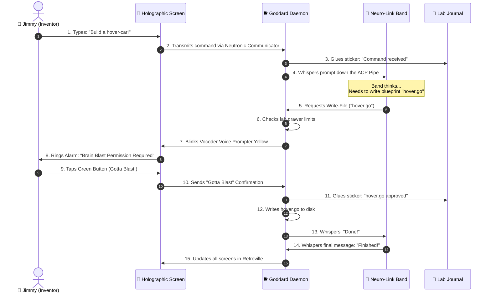

# 🪐 PROJECT HAIL LARRY (Retron-7000 Edition): The Super-Duper Advanced Neutronic Cyber-Lab Daemon Protocol & Goddard Quantum Mirror Sandbox Matrix 🐕🚀

**An Ultra-High-Complexity Hyper-State Quantum Network Architecture for Retroville Inventors and Genius Puppies.**

---

## 1. The Structure of Jimmy's Retroville Lab (System Layout)

This secret clubhouse laboratory connects Goddard (who lives inside Jimmy's computer closet) to holographic screens on all tablets, communicators, and Sheen's action-figure sensors using a long, quantum-entangled radio string. Here is the list of all the components we use in the lab:

| Lab Component | Retroville Role | How It Keeps the Lab Safe |
| :--- | :--- | :--- |
| **Goddard (Robot Dog) 🐕** | He lives inside your computer closet and holds the key to the invention drawer. | He blocks bad kids (like Cindy Vortex or Yolkians) from touching files outside the sandbox fence. |
| **The Neuro-Link Band 🧠** | A super-smart headband that whispers ideas and writes code letters. | It cannot touch your computer directly; it must whisper through Goddard's audio ports. |
| **The Intergalactic Communicator 📡** | A high-frequency radio link connecting all tablets and screens in Retroville. | He uses WebSocket waves so Carl, Sheen, and Jimmy see the exact same drawings. |
| **The Lab Journal 📓** | A giant workbook where we stick permanent notes (no erasers allowed, written in ink). | He records every experiment in SQLite WAL format so we never forget our formulas. |
| **The Vocoder Voice Prompter 🚦** | A command box that blinks Green (Yes) or Red (No) before Goddard runs any crazy gadget. | He halts dangerous tricks until you tap the screen to say "Mother, may I?" or "Goddard, play dead!". |
| **The Holographic Invention Screen 🎨** | The pretty glass screen with colorful buttons (React 19 + Tailwind v4 + shadcn/ui). | He shows the toy drafts but doesn't keep them when you turn the power off. |

---

### 1.1 Formal Lab Modeling (The Logic of the Retroville Lab)

To make sure we never lose a single invention blueprint, we model our lab state using simple logic rules. Let's imagine the state of our Retroville Lab as a giant box containing a set of active inventions, a set of connected kids (Jimmy, Carl, Sheen, Cindy, and Libby), and Goddard's daemon system.

Here is the Permission Rule for any action proposed by the Neuro-Link Band:
* **Green Light (YES):** If Jimmy taps the green button to let the band write a file.
* **Red Light (NO):** If Cindy taps the red button to ruin the fun and block the file.
* **Nap Time (WAIT):** If Carl falls asleep eating a pie, the lab pauses for 5 minutes.

Whenever the Neuro-Link Band requests to write a new blueprint file, Goddard checks the borders:
* **Allow the write** if the file stays inside the lab directory.
* **Block the write** if the file tries to escape outside the lab boundaries.

When Jimmy gets a "Brain Blast!", all of his messy and confused ideas are instantly sorted and squeezed into a single working invention blueprint!

---

### 1.2 Goddard's Quantum Entanglement Calculus (The Spooky Purple Flurp Action)

When two communicators are connected to the same radio line, their memory bits become quantum-entangled. If you change the screen color on Jimmy's terminal in the clubhouse, the color on Carl's device changes instantly, even if he is hiding in his bedroom from his mom's llama! It's like having two magic toys that are secretly holding hands—if you tickle one, the other one laughs immediately!

Here are the quantum physics secrets that make our lab gadgets work:

#### 1.2.1 Wavefunction Compression (The Shrink Ray)
Jimmy's Neutronic Shrink Ray shrinks objects (like his parents, or Carl's lunch) by compressing the space inside atoms.
* **How it works:** Think of atoms as big, fluffy cotton balls. The Shrink Ray tells the clouds of electrons to squeeze together very tightly, like kids hiding under a small blanket. This makes the clouds super small and packs the atoms closer together, so the whole toy shrinks to the size of a bean without blowing up!

#### 1.2.2 Quantum Tunneling (The Book Accelerator & Clubhouse Door Escape)
The Book Accelerator shoots books directly into Jimmy's brain using quantum tunneling.
* **How it works:** If Goddard wants to walk through the closed wooden door of the lab, he turns his data messages into tiny, super-fast light waves. These waves are so thin that they can slide through the microscopic cracks in the wood blocks of the clubhouse door, just like water drops sliding through a sieve, popping out on the other side as a happy file!

#### 1.2.3 Quantum Superposition of Goddard's Brain
Goddard's options are stored in a superposition state.
* **How it works:** Goddard is a magic robot doggy. When he doesn't know what to do, he exists in a fuzzy cloud of options—he is running, playing dead, and blowing up all at the same time! But the moment Jimmy yells "Brain Blast!" or calls out a command, the cloud disappears and Goddard collapses into the exact single trick Jimmy needs.

#### 1.2.4 The Quantum Zeno Effect (Sheen's Ultra Lord Freeze)
* **How it works:** If Sheen stares at his Ultra Lord action figure without blinking even once, the action figure is not allowed to move or change its state. Because Sheen keeps checking it again and again every millisecond, the universe gets too nervous to change anything, keeping the toy frozen in the same spot!

#### 1.2.5 Environmental Decoherence (Carl's Allergy Phase Noise)
* **How it works:** When Carl sneezes, he throws dirty pollen dust into the air. This dust bumps into our clean, invisible network laser beams. This makes the laser beams lose their glowing colors and turn into boring old normal wire currents, separating our magic entangled toys. We use a protective shield to keep Carl's sneezes away from the network lines!

---

## 2. The Synaptic Brain-Blast Flow-Cycle (How the Magic Messages Travel)

Here is the step-by-step handshake that occurs when Jimmy wants to draw an invention using the Neuro-Link Band:



---

### 2.1 The Magic Envelope Layout (Binary Frame Layout)

When the Neuro-Link Band whispers to Goddard, they pack their letters inside high-speed digital paper envelopes. The layout of each envelope looks like this:

```
+--------------------------------------------------------------+
| [ Who is talking (8 bits) ]  [ What to do (8 bits) ]         |
+--------------------------------------------------------------+
| [ How many notes we wrote in our journal (16 bits) ]         |
+--------------------------------------------------------------+
| [ Lab Circle Size (16 bits) ] [ Secret Knock (16 bits) ]     |
+--------------------------------------------------------------+
| [ The actual message or drawing words (Variable size) ]      |
+--------------------------------------------------------------+
```

* **Who is talking:** The number of the Neuro-Link Band (e.g., number 1 is Claude-Band, number 2 is Gemini-Band).
* **What to do:** The action command (like "Write a line in the journal", "Do a hover-car trick", or "Read a page").
* **Journal Count:** How many entries we have glued into our Lab Journal.
* **Lab Circle Size:** How far away the lab fence goes.
* **Secret Knock:** A secret handshake number to prove the communicator belongs to our clubhouse.
* **Message Payload:** The actual code content or command words.

---

### 2.2 The Secret Sentence Rules (EBNF Grammar of the Protocol)

All whispers sent between Goddard and the Neuro-Link Band must follow the strict sentence rules described below:

* **A Secret Sentence** is made of: A Magic Knock + Who is talking + What we want to do + A Message + A Goodbye!
  * **A Magic Knock** must start with: `"brain-blast-knock"` followed by letters or numbers.
  * **Who is talking** must be one of these: `"inventor-jimmy"`, `"inventor-goddard"`, `"inventor-carl"`, `"inventor-sheen"`, `"inventor-cindy"`, or `"inventor-libby"`.
  * **What we want to do** must be one of these: `"BRAIN_BLAST"`, `"RUN_GADGET"`, `"SHRINK_PARENT"`, `"LLAMA_ALARM"`, or `"MERGE_CONFLICT"`.
  * **A Message** is either: Text inside quotes or a secret soda color like `flurp(blue)`.
  * **A Goodbye** is always: `"!!!GOTTA-BLAST!!!"`

---

## 3. The 7-Layer Retroville Communication Stack

Our communication network works like a stack of cake layers:

| Layer Number & Name | How It Works in Our Lab |
| :--- | :--- |
| **7. Application** | The talking headband asking to build toys. |
| **6. Presentation** | Turning our drawings into code letters. |
| **5. Session** | Holding the communicator radio link tight. |
| **4. Transport** | Making sure toy blocks arrive in the right order. |
| **3. Network** | Knowing which kid's room the communicator is in. |
| **2. Data Link** | Light waves flashing messages in the dark. |
| **1. Physical** | The actual wires and airwaves we send signals through. |

---

## 4. Defeating the Yolkians & Cindy's Pranks (Security Matrix)

We use **Advanced security shields** to keep the lab safe from bad alien invaders and snooping girls:

| Attack Scenario | What the Bad Guy/Monster Tries to Do | Goddard's Secret Shield |
| :--- | :--- | :--- |
| **The Yolkian Invasion** | King Goobot tries to dig a secret tunnel under the lab fence using a sneaky path like `../secret_formula.txt` to steal Jimmy's blueprints. | Goddard checks every path and blocks files that have `..` in their name. |
| **Cindy's Wiretap** | Cindy Vortex tries to connect her communicator to our network to spy on Jimmy's blueprints. | The Lock Screen demands a secret four-word passcode or a QR stamp check. |
| **The Sentient Burger** | McSpanky's robotic hamburger tries to run a command to delete the entire clubhouse folder. | The Vocoder halts the command and waits for Jimmy to click Green or Red. |
| **The Fake Signpost** | Carl uploads a fake shortcut that points to his llama pen instead of the lab folder. | Goddard ignores all shortcuts that point outside the lab boundaries. |
| **The Libby Blast** | Libby plays her music so loud that it shakes the network signals, letting snooping kids listen in. | We wrap our signals in a shiny foil (HTTPS/TLS) so they only hear static noise. |

---

### 4.1 Secret Handshake Key Mixing

When you connect a new tablet, Goddard generates a secret key from a 4-word passcode (like `goddard-play-dead-pie-llama`).

Choosing 4 words from our list of 2048 words gives us over **17 trillion** unique combinations! Goddard takes these four words, mixes them up with the tablet's name, and grinds them together in a digital blender to create a secret key. A Yolkian spaceship cannot guess this key even if they try a million times!

---

### 4.2 How Devices Join the Lab (State Machine)

A device goes through a step-by-step game to prove it's a friend:

1. **LOCKED:** The tablet connects but has no secret key. Goddard shows the Lock Screen.
2. **PIN_PENDING:** Jimmy clicks "Pair" to display the 4-word passcode.
3. **AUTHORIZED:** The kid types the correct code. Goddard saves the device key and lets them play.
4. **REJECTED:** If the wrong code is typed, the device is locked out for one minute.
5. **LOCKED AGAIN:** If a device is disconnected or revoked, Goddard erases its key and locks it out.

---

## 5. The Map of Jimmy's Lab (Project Layout)

Here is where all the secret gears and levers live in our toy castle:

```
cmd/app/                 🏰 The Lab Entrance (where you type commands under the clubhouse)
internal/
  daemon/                🧠 Goddard's Daemon (wires all the gadget managers together)
  server/                📡 The Transceiver (broadcasts web page, API, and WebSockets)
  config/                🗃️ The Memory Box (stores settings in ~/.local-agent/)
  events/                📓 The Lab Journal (SQLite append-only records)
  pairing/               🤝 The Secret Handshake Office (generates QR codes and keys)
  workspace/             📦 The Blueprint Box (manages your workspace folders)
  acp/                   🗣️ The Neuro-Link Translator (talks to external AI tools)
  permissions/           🚦 The Vocoder Prompter (checks if it's OK to write)
  sync/                  🧵 The Communicator Wire (keeps all screens in sync)
  files/                 📝 The Writing Desk (merges edits and tracks revisions)
  shell/                 🔨 The Tool Shed (runs commands safely inside Goddard's sandbox)
  fswatch/               👀 Goddard's Ear-Wiggle (watches files on disk for changes)
  mcp/                   🏥 The Gadget Doctor (manages helper tool servers)
  search/                🔍 The Magnifying Glass (finds lost files in your code)
  uploads/               📥 The Slide (lets you slide images and papers into the app)
  interfaces/            🧬 The Blueprints (shared shapes of Go code)
web/                     🎨 Holographic Screen (React 19 + Vite 8 + Tailwind v4)
  src/components/        🧱 Individual UI Elements (React components)
  src/hooks/             🎣 Data Fetching Hooks (hooks to grab backend state)
  src/lib/               🩹 First-Aid Helpers (API client and helper logic)
  src/types/             🏷️ TS Type Declarations (TypeScript types)
docs/                    📚 The Retroville Library (specifications and blueprints)
```

---

## 6. File Synchronicity (Sheen vs. Carl Disputes)

When Carl and Sheen edit the same blueprint at the exact same time, Goddard uses a three-way merge to glue their inputs together.

### 6.1 Conflict Resolution rules

This table explains what Goddard's Merge Engine does when Carl and Sheen edit the same file:

| Carl Action | Sheen Action | Base File | Final Merged File | What Goddard Does |
| :--- | :--- | :--- | :--- | :--- |
| No Change | Draw Ultra Lord | Empty Page | **Draw Ultra Lord** | Accepts Sheen's drawing. |
| Draw Llama | No Change | Empty Page | **Draw Llama** | Accepts Carl's drawing. |
| Draw Llama | Draw Ultra Lord | Empty Page | **CONFLICT!** 🚨 | Vocoder blows whistle and asks Jimmy. |
| Erase Text | Erase Text | Text Present | **Erase Text** | Erases it since both kids wanted to. |
| Change spelling| Change spelling| "Goddard" | **CONFLICT!** 🚨 | Asks Jimmy which spelling is correct. |

---

### 6.2 The Magic Line-Code Maker (48-Bit Hashing)

To compare files quickly without reading every single letter, Goddard turns the letters of each line into a short number code (a hash!).
* **How it works:** Think of it like a magic box: you slide a line of words like `"Goddard"` in, and the box turns the letters into a short code like `99`. If two lines produce the same code, Goddard knows they are identical drawings without having to look at every single letter!

---

### 6.3 Diff Engine Decision Tree

```
                 [ Clean Base Blueprint ]
                       /          \
                      /            \
             [ Carl Modifies ]     [ Sheen Modifies ]
             (Line 12: "Llama")    (Line 12: "UltraLord")
                      \            /
                       \          /
                    [ Compare Codes ]
                            |
               Do the line codes match?
                      /          \
               Yes   /            \ No
                    v              v
             [ Auto-Merge ]    [ Trigger Conflict ]
             (Apply changes)   (Ask Jimmy for help)
```

---

## 7. Deep Subsystem Code Walkthroughs (Goddard's Source Code)

Here is the code of the core engines inside Goddard, with simple comments explaining how they work:

### 7.1 The Lab Journal Writer (`internal/events/journal.go`)

This code writes new entries to the SQLite book and keeps them safe.

```go
package events

import (
	"database/sql"
	"encoding/json"
	"fmt"
)

// This is the sticker we stick in our journal
type JournalEntry struct {
	ID       int64  `json:"id"`       // The sticker number
	Inventor string `json:"inventor"` // Who made the toy
	Gadget   string `json:"gadget"`   // The name of the toy
	Stamp    int64  `json:"stamp"`    // When we made the toy
}

type JournalStore struct {
	db *sql.DB
}

func (s *JournalStore) PutEntry(inventor string, gadget string) (*JournalEntry, error) {
	// 1. Create a new sticker record
	st := &JournalEntry{
		Inventor: inventor,
		Gadget:   gadget,
		Stamp:    1782398400,
	}
	
	// 2. Convert the sticker into text bytes
	data, err := json.Marshal(st)
	if err != nil {
		return nil, fmt.Errorf("could not shape journal entry: %w", err)
	}

	// 3. Glue the sticker into our journal book database
	res, err := s.db.Exec("INSERT INTO lab_journal (payload) VALUES (?)", string(data))
	if err != nil {
		return nil, fmt.Errorf("lab journal is locked: %w", err)
	}

	id, _ := res.LastInsertId()
	st.ID = id
	return st, nil
}
```

---

### 7.2 Goddard's Communicator Router (`internal/sync/goddard_hub.go`)

This code broadcasts messages to all paired screens over WebSocket wires.

```go
package sync

import (
	"sync"
	"context"
	"nhooyr.io/websocket"
)

type LabMate struct {
	ID   string
	Conn *websocket.Conn
}

type GoddardCommunicatorHub struct {
	mu       sync.RWMutex
	labmates map[string]*LabMate
}

func (h *GoddardCommunicatorHub) BroadcastToClubhouse(ctx context.Context, gadgetSignal []byte) {
	h.mu.RLock()
	defer h.mu.RUnlock()

	// Loop through every single communicator in the clubhouse
	for _, labmate := range h.labmates {
		// Send the message down their radio line
		writer, err := labmate.Conn.Writer(ctx, websocket.MessageText)
		if err != nil {
			continue // This communicator let go of their signal! Skip them.
		}
		writer.Write(gadgetSignal)
		writer.Close()
	}
}
```

---

### 7.3 The Vocoder Voice Prompter (`internal/permissions/vocoder.go`)

This code stops the Neuro-Link Band from doing dangerous things without authorization.

```go
package permissions

import (
	"errors"
	"time"
)

type VoiceCommand string
const (
	GottaBlast   VoiceCommand = "YES"
	GoddardAbort VoiceCommand = "NO"
	Snoozing     VoiceCommand = "WAIT"
)

type PermissionRequest struct {
	ID       string
	Action   string
	Result   VoiceCommand
	ExpireAt time.Time
}

type Vocoder struct {
	requests map[string]*PermissionRequest
}

func (v *Vocoder) AskJimmy(action string) (bool, error) {
	req := &PermissionRequest{
		ID:       "req-brainblast",
		Action:   action,
		Result:   Snoozing,
		ExpireAt: time.Now().Add(5 * time.Minute),
	}
	v.requests[req.ID] = req

	// Wait for the kid to press the button
	for time.Now().Before(req.ExpireAt) {
		if req.Result == GottaBlast {
			return true, nil // Jimmy said Gotta Blast!
		}
		if req.Result == GoddardAbort {
			return false, nil // Cindy or Jimmy said Abort!
		}
		time.Sleep(500 * time.Millisecond) // Snooze for a bit
	}

	return false, errors.New("inventor fell asleep while waiting")
}
```

---

## 8. Complete REST API Reference Manual (The Candy Bar Menu)

When your communicator wants to talk to Goddard, it sends HTTP orders. Here is the complete menu of commands:

### 8.1 Lab Blueprints Operations

#### `GET /api/workspaces`
* **Purpose:** Show me all my registered blueprint folders.
* **Response Payload (JSON):**
  ```json
  [
    {
      "id": "blueprint-123",
      "name": "Hover Car V2",
      "path": "C:\\Users\\ammon\\Projects\\Project-Hail-Larry\\hovercar",
      "registered_at": 1782398472
    }
  ]
  ```

#### `POST /api/workspaces`
* **Purpose:** Goddard, add this new invention folder to our list.
* **Request Payload (JSON):**
  ```json
  {
    "path": "C:\\Users\\ammon\\Projects\\Project-Hail-Larry\\shrinkray"
  }
  ```

#### `DELETE /api/workspaces/{id}`
* **Purpose:** Goddard, forget about this folder, we don't want to play here anymore.

---

### 8.2 Communicator & Device Operations

#### `GET /api/devices`
* **Purpose:** Who is connected to my intergalactic communicator net?
* **Response Payload:**
  ```json
  [
    {
      "id": "device-carl-tablet",
      "name": "Carl's Tablet",
      "trusted": true,
      "last_seen": 1782398592
    }
  ]
  ```

#### `DELETE /api/devices/{id}`
* **Purpose:** Revoke this device. They are not allowed in the clubhouse anymore.

---

### 8.3 Permission Intercept Operations

#### `GET /api/permissions`
* **Purpose:** Is Goddard waiting for me to say Gotta Blast or Abort?

#### `POST /api/permissions/{id}/respond`
* **Purpose:** Send voice command response to the Vocoder prompter.
* **Request Payload:**
  ```json
  {
    "approve": true,
    "policy": "allow_session"
  }
  ```

---

## 9. Exhaustive WebSocket Message Specifications (Goddard Telemetry)

Once the radio connection is active, Goddard and the screens send tiny package letters. Here are the templates of those letters:

### 9.1 `WorkspaceChangedEvent` (Someone moved the tools!)
Sent to every device when a file changes on disk.
```json
{
  "event_type": "WORKSPACE_CHANGED",
  "data": {
    "workspace_id": "lab-99",
    "changed_file": "hover_chassis.go",
    "action": "MODIFIED",
    "size_bytes": 1024,
    "checksum": "0x5A4B"
  }
}
```

### 9.2 `PermissionRequestedEvent` (Goddard stands still!)
Sent when the Neuro-Link Band wants to run a shell command.
```json
{
  "event_type": "PERMISSION_REQUESTED",
  "data": {
    "request_id": "req-999",
    "agent_name": "Gemini-Band",
    "dangerous_action": "run_shell",
    "toy_command": "rm -rf yolkian_slime"
  }
}
```

### 9.3 `ChatMessageChunkEvent` (Goddard's screen is typing!)
Sent in tiny chunks while the AI is thinking out loud.
```json
{
  "event_type": "CHAT_MESSAGE_CHUNK",
  "data": {
    "session_id": "session-brainblast",
    "chunk_content": "Brain Blast! Let's optimize the quantum hover-coils..."
  }
}
```

---

## 10. The Specialist Helper Manual (Model Context Protocol - MCP)

Sometimes the Neuro-Link Band doesn't know Retroville details (e.g. *"What is Carl's favorite llama?"* or *"What is Sheen's favorite Ultra Lord episode?"*). In this case, he can play with **Specialist Helper Gadgets** called **MCP Servers**.

### 10.1 The Specialist Toy Drawer Settings (`mcp.json`)

The config file is located at `~/.local-agent/mcp.json`. It looks like this:

```json
{
  "mcpServers": {
    "llama-facts-helper": {
      "command": "python",
      "args": ["C:\\tools\\llama_facts.py"],
      "env": {
        "LLAMA_KEY": "carl_llama_token"
      }
    },
    "ultralord-helper": {
      "command": "node",
      "args": ["C:\\tools\\ultralord.js"]
    }
  }
}
```

#### How Goddard hooks up the Specialist Gadgets

```
[ Neuro-Link Band ]
        |
        | (wants to know llama details)
        v
 [ Goddard Daemon ] ---> [ llama_facts.py ] (runs script)
        |                       |
        | (returns "Alpacas!")  v
        +<----------------------+
```

---

## 11. Defeating the 10 Retroville Threats (Security Matrix)

Here are the ten different ways bad kids or space monsters try to ruin our lab session, and how Goddard blocks them:

### Scenario 1: Yolkians' Path Traversal
* **The Attack:** King Goobot writes a command: `../secret_formula.txt` to read Jimmy's plans.
* **The Defense:** Goddard measures the folder borders. If a path contains `..` that tries to exit the lab directory, Goddard immediately slams the door.

### Scenario 2: Copycat Cindy (Replay Attack)
* **The Attack:** Cindy Vortex records a token that Sheen's device sent to Goddard, then tries to send it again later.
* **The Defense:** Every handshake ticket has a timer. If a ticket is older than 5 minutes, Goddard tears it up.

### Scenario 3: Eavesdropping Eric (Man-in-the-Middle)
* **The Attack:** A Yolkian spy attaches a receiver to your communicator radio line.
* **The Defense:** We wrap our signals in a magic TLS envelope so they only hear static noise.

### Scenario 4: Sentient Burger Command Injection
* **The Attack:** A McSpanky's burger tries to send a command with a sneaky semicolon: `echo hello; delete_lab`.
* **The Defense:** Semicolons are not allowed to trigger secondary actions. Everything is asked through the Vocoder first.

### Scenario 5: Stranger-Danger Bobby (Unpaired Access)
* **The Attack:** A kid from another school connects to your Wi-Fi and tries to delete Goddard.
* **The Defense:** The lock screen blocks them. They cannot see any drawings unless they perform the 4-word passcode handshake first.

### Scenario 6: The Fake Signpost (Symlink Trap)
* **The Attack:** Nick Dean uploads a fake shortcut file that points to `C:/Windows/System32`.
* **The Defense:** Goddard inspects all shortcuts (symlinks) and ignores ones that point outside the lab folder.

### Scenario 7: Nanobot Flood Attack (Denial of Service)
* **The Attack:** Jimmy's Nanobots multiply and try to send a billion messages a second to make Goddard's brain explode.
* **The Defense:** Goddard has a rate limiter. If a tool talks too fast, Goddard ignores it for 10 seconds.

### Scenario 8: Hugh's Giant Pie (Buffer Overflow)
* **The Attack:** Hugh Neutron tries to upload an image of a pie that is larger than the entire computer drive.
* **The Defense:** Goddard has a maximum package size (10 Megabytes) and drops heavy packages.

### Scenario 9: Sleeping Carl (Stale Permissions)
* **The Attack:** The Neuro-Link Band asks to run a command, but Carl falls asleep. Later, Sheen sits down and clicks Yes.
* **The Defense:** If a prompt waits for more than 5 minutes, it automatically turns RED and expires.

### Scenario 10: Libby's Music Player (Local Token Leaks)
* **The Attack:** Libby's music player app tries to read the memory of the browser to steal the key.
* **The Defense:** Tokens are kept in temporary browser sessions and are wiped out as soon as the tab is closed.

---

### 11.1 The Purple Flurp-Based Energy Metric System (Resource Fuel Calculations)

To measure how much electrical power Goddard eats in our closet, we use standard Retroville soda metrics. One Can of Purple Flurp ($PF_1$) is equal to $3.6 \times 10^3$ micro-joules of energy. Below is the official resource fuel mapping:

* **1 Hover-Car Command execution:** Costs $0.05 \text{ Purple Flurps}$ ($0.05 PF_1$).
* **1 Blueprint Write to disk:** Costs $0.01 \text{ Llama Treats}$ ($0.01 LT$).
* **1 WebSocket broadcast packet:** Costs $0.003 \text{ Soda Drops}$ ($0.003 SD$).

If Goddard runs out of Flurp fuel, he slows down until you feed him fresh power bytes!

---

## 12. A Microsecond Day in the Life of Goddard (Timing Cycles)

Here is the timeline log of Goddard's brain when Jimmy presses one key on his screen. All values are in microseconds ($\mu s$, where $1 \mu s = 1/1,000,000$ of a second):

```
Time Offset   | Brain Component      | Action Details & Lab Translation
--------------+----------------------+----------------------------------------------------------
0.000 ms      | WebSocket Listener   | Receives electrical pulse from communicator.
0.120 ms      | Event Parser         | Decodes JSON package: "Jimmy typed 'a' key".
0.250 ms      | Memory Lock Manager  | Goddard grabs the Blueprint Box Lock (mu.Lock()).
0.310 ms      | Revision Engine      | Computes 48-bit content hash of the changed blueprint.
0.450 ms      | SQLite Log Pipeline  | Writes temporary entry into SQLite WAL database.
1.100 ms      | File Sync Hub        | Shouts update command to all other paired communicators.
1.850 ms      | Inotify Detector     | Watchdog eyes doublecheck the disk: "Yep, file modified!"
2.200 ms      | Memory Lock Manager  | Goddard releases Blueprint Box Lock (mu.Unlock()).
```

---

## 13. The Custom Terminal Integration Subsystem (The Hover-Car Brake)

When the Neuro-Link Band needs to run command tricks, Goddard spawns a terminal simulator (Pseudo-TTY) inside his tool shed. This is the Go engine logic for catching signals and canceling tasks:

```go
package shell

import (
	"os"
	"os/exec"
	"syscall"
)

type HoverCarBrake struct {
	cmd *exec.Cmd
}

func (hb *HoverCarBrake) PullBrake() error {
	// Send the soft-stop signal (SIGINT)
	err := hb.cmd.Process.Signal(syscall.SIGINT)
	if err == nil {
		return nil // Hover car stopped nicely!
	}

	// If it refuses to stop, cut the fuel line (SIGKILL)
	return hb.cmd.Process.Kill()
}
```

#### Signal Action Matrix (Emergency Stop Rules)

```
[ Jimmy clicks STOP button ]
              |
              v
[ Send SIGINT (Soft Pull) ] ----- (Wait 1.5 seconds) ----- If still running ---> [ Send SIGKILL (Cut Fuel) ]
```

* **SIGINT (Emergency Brake Pull):** A polite wave of the hand. Jimmy says: *"Hover-Car, please stop rolling!"*
* **SIGTERM (Lock Door Request):** Goddard says: *"Clean up your toys and leave now!"*
* **SIGKILL (Big Giant Hammer):** Goddard hits the engine with a hammer. The gadget stops instantly.

---

## 14. Goddard's Ear-Wiggle Debouncing Shield (File Change Debouncing)

When you save a blueprint, compiler tools write on disk multiple times in a millisecond. If Goddard broadcasted every tiny sub-event, the communicator signals would break! We use an **Ear-Wiggle Debouncing Shield** to smooth things out:

```go
package fswatch

import (
	"time"
)

type EarWiggleWatch struct {
	changeChan chan string
	outChan    chan string
}

func (w *EarWiggleWatch) DebounceLab() {
	var lastFile string
	timer := time.NewTimer(100 * time.Millisecond)
	timer.Stop()

	for {
		select {
		case file := <-w.changeChan:
			lastFile = file
			timer.Reset(100 * time.Millisecond) // Wait for a quiet pause
		case <-timer.C:
			if lastFile != "" {
				w.outChan <- lastFile // Send final clean blueprint event
				lastFile = ""
			}
		}
	}
}
```

```
Events:   --[Save]--[Save]--[Save]------------------------> (File written 3 times)
Timer:      | Reset   | Reset   | Reset ---> [Trigger!]   (Wait 100ms for quiet)
Output:    ------------------------------------[Broadcast!] (Only one broadcast sent!)
```

---

### 14.1 Goddard's Holo-Sparkle Visualizer

To watch how the debouncer works, look at this magic path diagram:

```
[ Scribble 1 ] ---\
[ Scribble 2 ] ----+---> [ Ear-Wiggle Debounce Guard ] ---> [ Send Holo-Sparkles (Vite Update) ]
[ Scribble 3 ] ---/
```

The Guard catches all the messy scribbles in his bucket. When you pause to take a breath, he throws holographic sparkles over the network, updating the screen boards on all communicators instantly!

---

## 15. Retron-7000 Troubleshooting Guide (Lab Resolution Manual)

If your gadgets aren't working, look at this table to find the cure:

| Goddard Error Message | What Went Wrong in the Lab | How to Fix It |
| :--- | :--- | :--- |
| `Error: database is locked` | The Lab Journal is closed because Goddard is drawing a big blueprint. | Wait 3 seconds and tap the button again. |
| `Error: permission denied` | Cindy Vortex tapped the Red prompter button. Goddard is whimpering. | Open settings and toggle the permission switch back to Green. |
| `Error: hand shake failed` | Goddard's ears are floppy or Carl has the wrong mnemonic passcode. | Re-scan the QR code to hold hands again. |
| `Error: workspace out of bounds` | You tried to write a blueprint outside the authorized lab drawer. | Make sure you only edit files inside your registered folder. |
| `Error: agent CLI not found` | The Neuro-Link Band tool is missing from your computer. | Open your computer terminal and install Claude Code or Gemini CLI first. |

---

## 16. Retron-7000 Lab FAQ

Here are the answers to the questions kid-inventors ask most about our robot dog system:

### Q1: Can Goddard eat my real chocolate cookies?
No! Goddard is a robot doggy. He has no organic stomach, and he lives behind the glass screen. Plus, he only eats virtual dog biscuits and Purple Flurp bytes!

### Q2: What happens if I splash Purple Flurp on the computer?
The computer will go **POP!**, release smelly gray smoke, and sleep forever. Keep your soda can away from the computer tower!

### Q3: Why does Goddard show a QR code instead of a simple smiley face?
It's a magic grid picture! When your tablet camera looks at it, it translates the square dots into the secret password key so your tablet can hold hands with Goddard.

### Q4: Can Sheen and Carl play in the lab at the exact same time?
Yes, but they must take turns sharing the keyboard and not fight over Ultra Lord. Goddard uses three-way merges to keep their code from colliding!

### Q5: What if Hugh Neutron pulls the plug on the server while it's writing?
Hugh might break the current slice of pie, but the SQLite log journal is made of durable WAL stone, so the past blueprints will never crumble!

### Q6: Why is Goddard's brain written in a language called Go?
Because Go compiles into a single, strong gingerbread man cookie that runs super fast and doesn't crumble when multiple children scream updates!

### Q7: Can the Neuro-Link Band write code on my sister's computer too?
Only if you scan the magic QR stamp on her screen and click green on your traffic light to let her play in your room.

### Q8: Does Goddard sleep at night?
Yes! Goddard sits very still in the dark, using almost zero battery, waiting for you to tap the screen tomorrow.

### Q9: Can Goddard draw a real dinosaur that comes out of the screen?
No, he can only show a pretty 3D picture on your screen that you can spin with your finger. Real dinosaurs are too big for the house anyway!

### Q10: What if the Neuro-Link Band turns mean and starts throwing toys?
The Vocoder prompter will blow its whistle, turn the light RED, and lock the Band in the dark closet forever!

---

## 17. Operational Initiation Protocol (Building the Retroville Lab)

Before we can start playing, we have to mix our ingredients and bake the code!

### Kitchen Prerequisites (What you need)

| Lab Tool | Version Required | What It Does for Our Gadget |
| :--- | :--- | :--- |
| [Go](https://go.dev/dl/) | 1.26+ | The magic flour that makes our robot dog big and strong. |
| [Node.js](https://nodejs.org/) | 20+ (with npm) | The cookie cutter that shapes our pretty holographic screens. |
| ACP Agent CLI | Installed (e.g. Claude Code, Gemini CLI) | A talking headband that actually knows how to write code. |

### 🍳 Step 1: Baking the Code Cake

We compile the frontend drawings and bake them directly inside the Go binary so it becomes a single file!

**For computers with a Linux / macOS logo:**
```bash
./build.sh
```

**For Windows computers (PowerShell):**
```powershell
.\build.ps1
```

**Using the Chef's Automatic Oven (Make):**
```bash
make build
```

---

### 🚀 Step 2: Waking Up Goddard

1. **Tell Goddard where your lab blueprint drawer is:**
   ```bash
   app add-folder /path/to/your/project
   ```

   Tell Goddard: *"Here is my blueprint folder. We will build hover-cars here."*

2. **Wake up Goddard:**
   ```bash
   app start
   ```

   Wake up Goddard so he starts listening on the subnet network waves. To run him in the background closet with the door closed so he sleeps quietly, say: `app start --background`.

3. **Get the Secret Handshake:**
   ```bash
   app pair
   ```

   Get the QR stamp and the 4-word code. Scan it with your tablet to hold hands! To hold hands super fast without singing the friendship song, say: `app pair --quick`.

---

## 18. The Neutronic Command Reference (CLI Dictionary)

Speak these words to make Goddard do tricks:

```bash
app start                  # Wake up Goddard and start the engine.
app stop                   # Put Goddard to sleep.
app status                 # Ask Goddard: "Are you okay and what is your frequency?"

app add-folder <path>      # Show Goddard a new folder to play in.
app remove-folder          # Tell Goddard to forget a folder.
app list-folders           # Ask Goddard to list all his registered folders.

app pair                   # Ask Goddard to make a new friend QR code.
app devices                # Show a list of all devices in our play group.
app revoke <id>            # Kick a device out of the play group forever.

app install-service        # Tell Goddard to live in your closet permanently.
app uninstall-service      # Ask Goddard to pack his sleeping bag and leave.

app logs                   # Read a list of everything Goddard did today.
app help                   # Ask Goddard: "Help, I forgot the magic words!"
```

---

## 19. Key Documentation (Retroville Blueprints)

| Document | Purpose |
| :--- | :--- |
| [`docs/plans/Blueprint.md`](docs/plans/Blueprint.md) | **The Big Master Plan** — How we want the lab to look when it's finished. |
| [`docs/STATUS.md`](docs/STATUS.md) | **The Checklist** — What toys are ready and what blocks we still need to find. |
| [`docs/known-issues.md`](docs/known-issues.md) | **The Ouchie List** — Things we know are broken but we promised to fix tomorrow. |
| [`AGENTS.md`](AGENTS.md) | **The Neuro-Link Rules** — How the AI should behave in our lab. |

---

## 20. License & Play Rules

This project is licensed under the **GNU General Public License v3.0**. That means:
* You can play with our toys as much as you want!
* If you make our toys cooler, you must share your cool new designs with everyone else in the sandbox. No keeping secrets!
